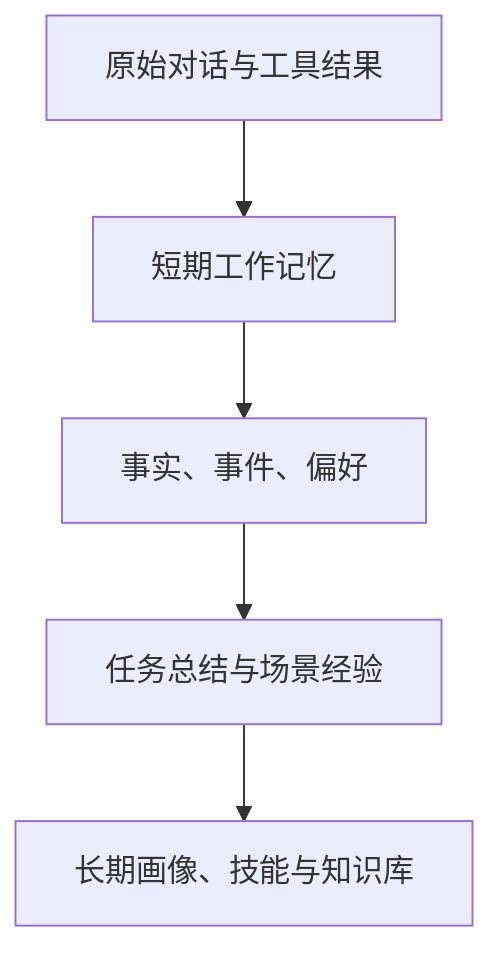
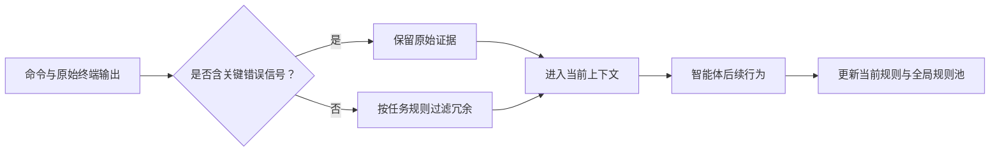

# 从零理解 Agent Memory：为什么智能体需要“记忆”

第一次使用大语言模型时，很多人都会有一个困惑：它明明刚刚理解了我的需求，为什么开一个新对话就像从来没见过我？

这不是它故意健忘，而是大多数模型默认只看得到当前会话中被放进上下文窗口的内容。对话一结束、内容超出窗口，模型并不会自动带着这些信息进入下一次任务。

当我们希望模型不只是回答问题，而是持续完成开发、研究、运营等工作时，它就成了 **Agent（智能体）**。此时，“记忆”不再是一个锦上添花的功能，而是让智能体能连续工作的基础设施。

## 先区分：模型本身并不会长期记住你

可以把大模型想象成一位阅读速度极快的临时顾问。

- 你把资料放到桌上，它能结合资料给出很好的建议；
- 你把资料收走，再请它回来，它通常没有理由记得上次桌上有什么；
- 即使资料还在桌上，桌面也有限，放得太多会变慢、变贵，还可能遗漏重点。

所谓 Agent Memory，并不是修改模型大脑、让模型永久学习某件事。它更像给智能体配了一个外部资料库和一套使用规则：在合适的时候写入信息，在需要时找回最相关的部分，再把它放回当前上下文中。

```text
用户 / 环境 / 工具执行结果
            ↓
      记录、提炼、分类
            ↓
        外部记忆库
            ↓
   检索相关内容并注入提示词
            ↓
        大模型完成当前任务
```

## 一个简单例子

假设你让一个编程智能体维护网站。

第一天，你告诉它：

> 这个项目使用 TypeScript；支付模块不要重构，因为旧版 App 仍在调用它；部署前必须执行端到端测试。

如果没有记忆，第二天的新会话里，你可能还得重新说明这三件事。更糟的是，智能体可能“好心”地重构支付模块，造成兼容性问题。

有了记忆后，智能体在开始改动支付相关代码时，可以检索到这条历史决策，并主动避开风险。它不是变得无所不知，而是能在正确的时刻找回已经确认过的信息。

## Agent Memory 通常记什么？

记忆不等于完整保存每一句聊天。真正有用的内容往往是经过筛选和整理的。

### 1. 用户与协作偏好

例如用户偏好中文、喜欢先看结论、要求修改前先运行测试。这类信息相对稳定，适合长期保留。

### 2. 事实、决策与约束

例如“生产环境使用 PostgreSQL”“这个接口要兼容 v1 客户端”“周五前不能合并大型改动”。它们通常直接影响任务质量。

### 3. 任务过程与经验

一次排障中发现的根因、一次发布中有效的检查清单、一次调研中可信的资料来源，都可以沉淀为下次可复用的经验。

### 4. 外部知识资产

文档、代码仓库、会议纪要、FAQ、工具说明也可以成为记忆来源。不过这类内容通常不应全部塞进对话，而应先建立索引，需要时再检索。

## 记忆为什么要分层？

原始对话很完整，但也很嘈杂；总结很精炼，却可能丢失细节。因此，许多系统会把记忆分成不同层次：



- **短期记忆**：服务当前任务，例如最近几轮对话、刚读取的文件、刚调用工具的结果。
- **情景记忆**：保存某个任务或项目中的关键经过，例如“上次上线为什么回滚”。
- **长期记忆**：保存稳定偏好、长期规则和经过验证的知识。

分层的核心不是术语，而是一个朴素原则：**细节应当可追溯，长期上下文应当足够精炼。**

## 记忆系统是怎么“想起”信息的？

常见流程可以概括为四步：

1. **写入**：从对话、文件或工具结果中发现值得保存的信息。
2. **整理**：去重、归类、提炼，并附上时间、来源和适用范围。
3. **检索**：当新任务到来时，按关键词、语义相似度、项目范围或时间筛选相关内容。
4. **使用**：只把少量高相关记忆放进当前上下文，并让智能体据此行动。

这里最容易被忽略的是第三步。记忆库再大，如果检索不准，智能体拿到的仍然是噪声；如果每次把所有记忆都放进提示词，上下文又会膨胀。因此，好的 Memory 系统比“存得多”更重视“在正确的时候取对内容”。

## 论文带来的一个关键视角：记忆也需要“压缩”

谈到 Memory，人们很容易只想到“把过去存起来”。但在真实的长任务中，还有另一半问题：**当前正在发生的信息，也会迅速把上下文塞满。**

例如，一个终端智能体连续执行安装依赖、编译、测试和排错命令。终端会产生大量日志，其中大部分是进度条、重复提示和成功信息；但夹在其中的一行报错、一个文件路径或一个失败的测试名称，可能决定下一步应该怎么做。

论文 [*A Self-Evolving Framework for Efficient Terminal Agents via Observational Context Compression*](https://arxiv.org/abs/2604.19572) 把这个问题称为“终端观察压缩”。作者提出 TACO：不要简单地把终端输出总结成几句话，而是学习一组可复用的压缩规则，在删除冗余内容的同时，尽量原样保留关键证据。

这和普通摘要有什么不同？可以这样理解：

| 做法 | 可能发生的事 |
| --- | --- |
| 直接摘要 | “测试失败了”——简洁，但可能丢掉失败测试名、报错栈和文件位置。 |
| 固定过滤规则 | 能删除一些已知噪声，但换了语言、仓库或命令后，规则可能失效。 |
| TACO 式压缩 | 根据任务和终端输出模式选择、更新规则；发现过度压缩时变得更保守。 |

TACO 的机制对初学者可以概括为三步：

1. **任务开始前**：从全局规则池中找出可能适用的压缩规则，再根据当前任务进行筛选。
2. **任务进行中**：对于普通日志执行压缩；如果出现异常、报错或失败信号，则优先保留完整输出。
3. **任务结束后**：把经验证有效的规则写回规则池；如果智能体要求看完整输出、重复执行命令等，系统将其视为“压缩过头”的反馈，降低相关规则的可信度。



论文在六个终端类基准上报告：在保持或提升任务成功率的同时，端到端 token 消耗下降约 12% 至 27%。这些数字来自特定实验设置，不能直接等同于所有产品场景的收益；但它说明了一个重要原则：**上下文管理不是单纯省 token，而是在有限注意力中保护最有行动价值的信息。**

从 Memory 的角度看，长期记忆负责“跨会话记住什么”，而观察压缩负责“本次任务中如何不被噪声淹没”。两者共同决定智能体能否在长任务里持续、可靠地工作。

## 记忆不是越多越好

记忆也会过期。

旧的技术方案可能已经废弃，临时决定可能早已撤销，过去的偏好也可能发生变化。如果系统把所有信息同等对待，过期记忆会像错误的说明书一样误导智能体。

所以，一个可靠的 Agent Memory 系统通常需要：

- 记录来源与更新时间，方便追溯；
- 区分长期规则和临时信息；
- 支持修改、删除、过期和权限控制；
- 对重要结论保留人工审核；
- 在检索时考虑项目、角色、时间和可信度。

对团队而言，这一点尤其重要：私人偏好不应自动变成团队规则，敏感项目资料也不应被所有 Agent 随意读取。

## 什么时候值得引入 Memory？

如果你的使用场景只是偶尔问一个独立问题，普通聊天已经足够。但出现下面的情况时，Memory 的价值会迅速上升：

- 同一个项目需要反复与 Agent 协作；
- 多个 Agent 或多人需要共享上下文；
- 任务跨越多天，且决策、约束较多；
- 需要让 Agent 阅读代码、文档和历史记录；
- 希望把一次成功的工作方式变成可复用流程。

可以从最小实践开始：先记录少量明确的项目约束和用户偏好，再为常见任务建立简短的复盘或检查清单。等记忆数量增加后，再引入向量检索、知识图谱、权限和自动化提炼等能力。

## 结语

Agent Memory 的本质，是把一次性的对话与行动，变成可被下一次工作利用的经验。

它不会让模型突然拥有人的长期记忆，也不能替代人的判断；但它能让智能体少重复提问、少重复阅读、少重复踩坑。当记忆能够被记录、检索、更新和治理时，智能体的工作才真正开始具备连续性与复利。
