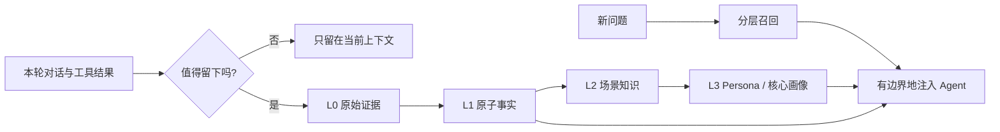

# 1. 为什么 Agent 需要 Memory

## 先从一个失败的 Agent 开始

假设你有一个会写代码的 Agent。今天你告诉它：

> 这个项目使用 pnpm，测试命令是 `pnpm test`，不要修改 `legacy-auth/`，发布前必须运行迁移检查。

如果这些信息只存在于今天的上下文窗口里，明天新开一个 Session，Agent 仍会重新犯错。把整个历史对话原样塞回去也不理想：成本很高，而且旧的、无关的内容会淹没有效约束。

所以 Memory 要解决的不是“保存更多”，而是三个判断：

1. 什么信息值得跨回合保留？
2. 信息如何从原话变成可搜索、可解释的结构？
3. 当前问题来了，应该召回多少，放到 Prompt 的什么位置？

## Memory 和聊天历史、RAG 有什么区别？

| 能力 | 聊天历史 | 普通 RAG | Agent Memory |
| --- | --- | --- | --- |
| 保留原始证据 | ✅ | 取决于实现 | ✅ L0 |
| 提炼长期偏好 | ❌ | 通常没有 | ✅ L1/L3 |
| 组织一个工作场景 | ❌ | 通常是平铺 chunk | ✅ L2 |
| 识别冲突与更新 | ❌ | 需要额外逻辑 | ✅ 去重/合并 |
| 控制注入预算 | 粗粒度 | 常见 top-k | 分层 + 字符/条数预算 |
| 能否追溯来源 | 有，但难用 | 依赖 metadata | 从 L3/L2 回到 L1/L0 |

> **一个实用判断：** RAG 更像“我有一批资料，帮我找相关段落”；Memory 更像“我和这个人/项目长期合作，帮我恢复正确的工作状态”。

## 贯穿全教程的设计原则

### 证据与摘要分开

摘要可能有误，因此上层内容必须能够指回原始消息。官方仓库把底层记录和上层 Markdown/场景文件分开，目的就是保留白盒可检查性，而不是让 LLM 的一次总结成为不可逆的事实。

### 读写异步化

用户正在等 Agent 回答时，不应该同步完成所有 L1/L2/L3 提取。先写入 L0，再由后台 Pipeline 处理，下一轮再读取已经完成的记忆。

### 失败时宁可少注入

一个空的 Memory 不会污染回答；一个错误的 Persona 可能让 Agent 连续很多轮都沿着错误假设工作。因此召回、解析、Embedding、LLM 超时都要有降级路径。

## 本章小练习

把下面信息分别归类：

1. “用户喜欢答案先给结论，再给解释。”
2. “2026-08-10 这次部署因为端口占用失败。”
3. “支付项目的发布流程：先灰度，再观察 30 分钟。”
4. “上一轮工具输出的 30 万字日志。”

参考答案：1 是长期 Persona/偏好；2 是带时间的 L1 事件；3 是 L2 场景或 Skill；4 应该外置保存，当前上下文只保留摘要和 `node_id`。

## 参考资料

- [TencentCloud/TencentDB-Agent-Memory 官方仓库](https://github.com/TencentCloud/TencentDB-Agent-Memory)
- [腾讯云：Agent Memory 产品介绍](https://cloud.tencent.com/document/product/1813/132100)
