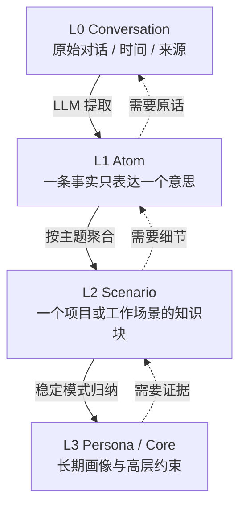

# 2. 四层记忆模型：L0 → L3

官方实现的长期记忆主线可以概括为一座“语义金字塔”：越往下越接近事实证据，越往上越适合快速恢复语境。

## 四层各自负责什么？

| 层级 | 名称 | 典型内容 | 写入方式 | 读取方式 |
| --- | --- | --- | --- | --- |
| L0 | Conversation | 原始用户消息、Agent 回复、时间、Session | 每轮结束快速追加 | 关键词/向量查原话 |
| L1 | Atom | 偏好、事实、约束、事件、决策 | LLM 提取 + 冲突判定 | 相关性召回 |
| L2 | Scenario | 围绕项目/主题组织的场景块 | 聚合多个 L1 | 先读索引，需要时下钻 |
| L3 | Core / Persona | 稳定画像、长期模式、全局约束 | 从多个 L2 归纳 | 每轮低成本注入 |

注意：L2/L3 并不是“更真实”，而是“更高层的工作摘要”。真正要做高风险决策时，仍然应该回到 L1/L0 查证。



## 为什么不直接把 L0 做向量搜索？

直接搜索 L0 有两个问题：

- **噪声多**：寒暄、代码块、工具日志、重复的 Agent 解释都会参与排序。
- **语义不稳定**：问题“我习惯的测试命令是什么？”可能与原话“以后都用 `pnpm test`”词面差别很大。

L1 的作用是把原话变成可操作的最小单元，例如：

```json
{
  "id": "mem_001",
  "content": "项目使用 pnpm，测试命令是 pnpm test",
  "type": "constraint",
  "priority": 90,
  "scene": "项目工程约定",
  "sources": ["l0_2026-08-10_003"]
}
```

这条记录短、可检索、可标优先级，也保留了 `sources` 供追溯。

## L2 的“场景”不是简单摘要

一个场景块更像“可导航的工作记忆”：它可以包含当前目标、阶段结论、已知约束、常见错误和来源链接。官方实现把场景保存为可读的 Markdown 文件，并配套索引；这样 Agent 先读场景目录，只有需要时才读取完整文件。

示例：

```markdown
# 项目工程约定

## 当前结论
- 包管理器是 pnpm。
- 测试前先执行 pnpm lint。

## 来源
- l1/mem_001
- l0/2026-08-10.jsonl#l0_003
```

## L3 为什么适合注入 System Prompt？

L3 变化频率低，内容短，适合放在稳定的 system context 中；L1 查询结果随问题变化，适合放在本轮 user context 前。这样可以避免每次搜索结果改变都让整个 system prompt 失去缓存价值。

```text
稳定区：Persona + 场景导航 + 工具使用说明
动态区：本轮问题召回的 L1 事实
原始证据：需要时通过搜索工具或 node_id 下钻
```

## 四层模型的边界

不要把所有内容都升级到 L3：

- 一次性的“昨天午饭吃了什么”应停留在 L0/L1。
- “用户不喜欢表格”可能是偏好，值得进入 L3，但应该有置信度和最近更新时间。
- “支付服务的发布步骤”可能更适合作为 Skill/SOP，而不是用户 Persona。

### 练习：设计一个记忆记录

为“用户说：我在上海，回答请使用北京时间；这个月的报表项目用 Python，不能引入新的依赖”设计 L1 记录。建议拆成三条，而不是一条长句：

```text
profile: 用户所在时区是 Asia/Shanghai
preference: 时间表达默认使用北京时间
constraint: 当前报表项目使用 Python，不能引入新依赖
```
