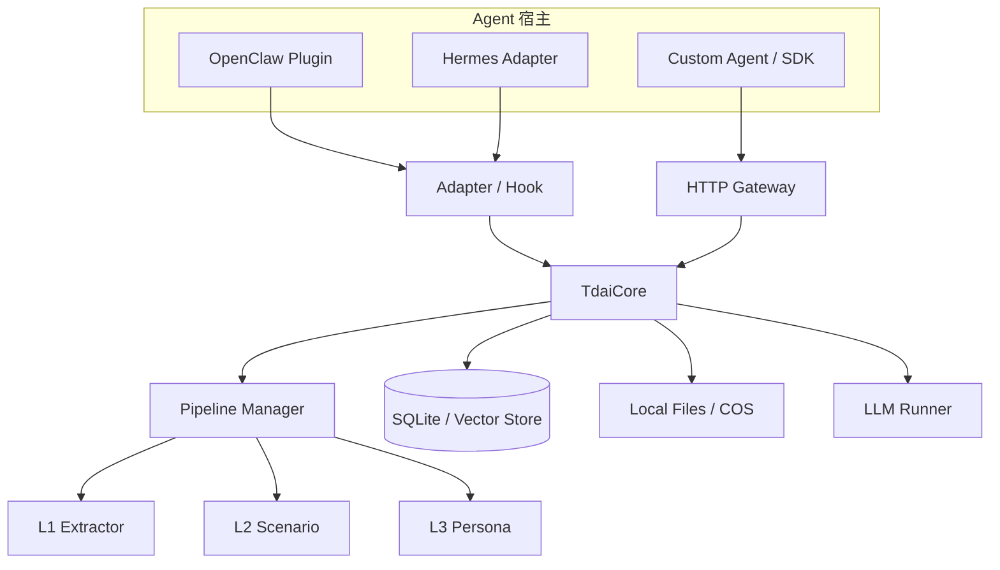

# 3. 官方架构：Core、Adapter 与 Gateway

理解目录之前，先抓住一个解耦：**记忆核心不应该知道 Agent 框架的事件对象长什么样。**

官方仓库当前的 MemoryCore 是 host-neutral facade：OpenClaw、Hermes 或自定义应用通过 Adapter/SDK 接入；Gateway 则把同一套能力暴露为 HTTP。



## 四个边界

### 1. Hook：知道“什么时候”调用

OpenClaw 插件里的 `before_prompt_build` 适合召回，`agent_end` 适合捕获。Hook 不负责做复杂检索，它把宿主事件转换成统一参数。

### 2. Core：知道“做什么”

`handleBeforeRecall(userText, sessionKey)` 和 `handleTurnCommitted(turn)` 是很好的核心接口。上层不需要知道 SQLite、BM25 或定时器细节。

### 3. Store：知道“存在哪里”

SQLite、Tencent Cloud VectorDB、COS 只是后端选择。教学版先用 JSON 文件和内存数组，以便你能看懂每一个数据结构；生产版再替换 Store 接口。

### 4. Gateway/SDK：知道“怎么跨进程调用”

官方 MemoryCore Gateway 默认提供健康检查、capture、recall、search、session end 等接口；SDK 把这些 HTTP 调用封装成 `addConversation()`、`searchAtomic()`、`readCore()` 等方法。

## 一次用户回合的时序

```mermaid
sequenceDiagram
  participant User as 用户
  participant Hook as before_prompt_build
  participant Core as MemoryCore
  participant Store as Store
  participant Agent as Agent
  participant End as agent_end
  participant Pipe as Pipeline

  User->>Hook: 新问题
  Hook->>Core: recall(query, identity)
  Core->>Store: 搜索 L1 + 读取 L2/L3
  Store-->>Core: 相关记忆
  Core-->>Hook: stable + dynamic context
  Hook->>Agent: 注入有边界的上下文
  Agent-->>User: 回答 / 工具调用
  End->>Core: capture(turn)
  Core->>Store: 追加 L0（快速返回）
  Core->>Pipe: notify(session)
  Pipe-->>Core: 异步 L1 → L2 → L3
```

## 从源码目录建立映射

参考仓库的目录很多，先只看这些：

```text
MemoryCore/src/core/
├── conversation/       # L0 记录
├── record/              # L1 提取、去重、读写
├── scene/               # L2 场景文件与索引
├── persona/             # L3 画像触发与同步
├── store/               # SQLite、BM25、Embedding、TCVDB
├── hooks/               # auto-capture / auto-recall
├── offload/             # 短期上下文外置与压缩
└── tdai-core.ts         # 面向宿主的统一 facade
```

这个映射也会成为教学版的实现顺序：先写数据，再写提取，再写检索，最后接到 Agent。

## 为什么不用一个“万能 Memory 类”？

因为变化方向不同：

- L0 关心追加、游标、幂等和清洗。
- L1 关心结构化提取、冲突判定和检索。
- L2/L3 关心聚合、文件导航和更新频率。
- Adapter 关心宿主生命周期。

把这些逻辑揉在一起，最容易出现“召回时触发写入”“记忆注入后又被重复捕获”之类的反馈环。
