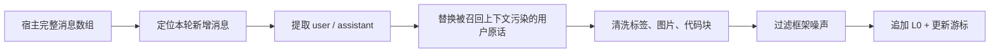

# 4. L0：安全地捕获原始对话

L0 的目标是“尽量完整，但不污染”。它不是最终记忆，只是以后提取和查证的证据层。

## L0 为什么要单独设计？

如果每轮直接让 LLM 总结，失败时没有原话可重放；如果把宿主的完整消息数组原样落盘，又会把工具日志、图片 Base64 和已经注入的记忆一起存进去。

因此官方捕获链路可以抽象成：



## 两层增量保护：position slice + timestamp cursor

仅靠时间戳不够可靠：重启、时钟漂移、缺少 timestamp 都会导致重复写入。仅靠数组位置也不够可靠：宿主可能改变消息结构。

教学版可以先实现时间戳游标；理解官方做法后再加位置切片：

```ts
const newMessages = allMessages.filter(
  (message) => message.timestamp > checkpoint.lastTimestamp,
)

const clean = newMessages
  .map(sanitizeMessage)
  .filter((message) => shouldCaptureL0(message.content))

await appendJsonl(clean)
checkpoint.lastTimestamp = maxTimestamp(clean)
await saveCheckpoint(checkpoint)
```

关键点是 `append` 和 `checkpoint update` 需要原子化。否则进程在写入成功、游标更新失败时，下一次会重复捕获；反过来先更新游标又会丢消息。

## 召回污染是一个很隐蔽的 Bug

很多 Agent 框架会在 `before_prompt_build` 后把召回结果拼到用户消息里。到了 `agent_end`，宿主传回的用户消息可能变成：

```text
<relevant-memories>用户偏好 ...</relevant-memories>
我真正的问题是：帮我修复测试。
```

如果直接保存，下次搜索会搜到自己注入的内容，形成反馈循环。解决方案是：在 prompt build 阶段缓存干净的 `originalUserText` 和原始消息数量，capture 时用它替换被污染的用户消息。

## L0 数据格式建议

教学版使用一个对象一行的 JSONL，便于流式追加和 `rg` 查询：

```json
{"id":"l0_001","sessionId":"sess_1","role":"user","content":"项目用 pnpm","timestamp":"2026-08-10T10:00:00.000Z"}
```

不要把一个 Session 的全部消息塞成一个巨大 JSON：后续增量读取、坏行恢复和按日期归档都会更麻烦。

## 常见错误

| 错误 | 后果 | 修复 |
| --- | --- | --- |
| 把 L1 记忆注入文本原样写回 L0 | 反馈循环，搜索结果越来越脏 | 捕获前剥离标签/恢复原话 |
| 没有 cursor | 每轮重复写整段历史 | position slice + timestamp |
| 把 tool result 全部持久化 | L0 体积膨胀，提取噪声大 | 工具日志单独 offload，L0 只留可解释内容 |
| 游标先写、数据后写 | 崩溃时丢消息 | 将写入与游标更新放进锁/事务 |

## 小练习

为下面消息设计 `shouldCaptureL0`：

```text
"好的"                         -> 丢弃或低优先级
"/reset"                       -> 丢弃
"我以后都用 UTC+8"             -> 保留
"NO_REPLY"                     -> 丢弃
"请把支付服务拆成三层"         -> 保留
```

你会发现，L0 过滤应该宽松；真正严格的“值得成为记忆”判断放到 L1。
