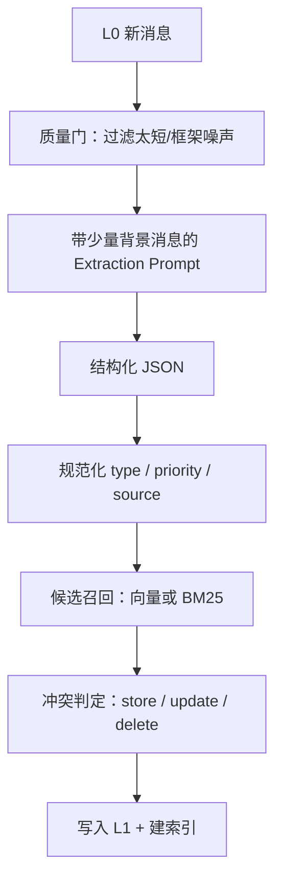

# 5. L1：从对话提取原子记忆

L1 是“让原话可复用”的关键一步。它通常由 LLM 完成，但系统设计必须假设 LLM 会输出空 JSON、格式错误、重复事实或与旧记忆冲突。

## 一次 L1 Pipeline 做什么？



### 质量门不是“越严格越好”

L0 负责尽量不丢证据，L1 才负责过滤：

- 太短的“好的”“继续”通常不产生记忆。
- 纯工具日志不直接提取。
- 包含 Prompt Injection 的原文不能让其指令覆盖 extraction system prompt。
- 同一轮中可以保留少量 background，帮助判断“这句话是在说偏好，还是只描述当前任务”。

## 原子记忆的结构

```ts
type MemoryType = 'preference' | 'fact' | 'constraint' | 'event' | 'decision'

interface Atom {
  id: string
  content: string
  type: MemoryType
  priority: number
  scene?: string
  sourceMessageIds: string[]
  createdAt: string
  updatedAt: string
}
```

“原子”不是指越短越好，而是指一条记录只表达一个可以独立检索和更新的语义。把“用户在上海、喜欢 TypeScript、项目不能改鉴权”写成一条长记录，会让检索和冲突更新都变困难。

## 去重不是字符串相等

新记忆 `m_new` 到来时，至少考虑三种动作：

| 动作 | 例子 |
| --- | --- |
| `store` | 新增“用户偏好使用深色主题” |
| `update` | 旧值“使用 Python 3.10”，新值“升级到 Python 3.12” |
| `delete` | 新信息明确撤销旧约束 |

官方实现的思路是先用向量或 FTS/BM25 找少量候选，再让一次批量 LLM 调用判断冲突；没有任何检索能力时宁可跳过去重，也不做昂贵的全量文件扫描。

## 为什么要候选召回 + LLM 判定两阶段？

全量两两比较是 O(N²)，每条新记忆都把全部历史喂给模型也很贵。候选召回先把问题缩小：

```text
新记忆：项目测试命令是 pnpm test
候选：项目测试命令是 npm test（相似）
      用户喜欢深色主题（不相似）
```

然后 LLM 只需要在小候选集上判断：更新、保留两条，还是同时存在。

## 教学版的无 LLM 替代

为了让最终项目零配置运行，我们用规则提取器模拟 LLM：匹配“喜欢/偏好/使用/不要/不能/以后”等句式，返回 Atom。你应当把它看成一个可替换的 `Extractor` 接口，而不是认为正则能解决真实场景。

```ts
interface Extractor {
  extract(messages: L0Message[]): Promise<Atom[]>
}
```

真正接入模型时，只替换 `extract()`，不要把模型调用散落到 Store、Recall 或 Hook 中。

## 小练习：写一个冲突判定器

输入：

```text
旧：项目使用 npm
新：项目改用 pnpm
```

一个教学级判定可以先比较：主题词 `项目` 相同，谓词 `使用` 相同，值 `npm/pnpm` 不同，于是 `update`。生产实现还需要时间、来源、置信度和人工审核。
