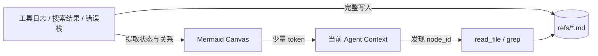
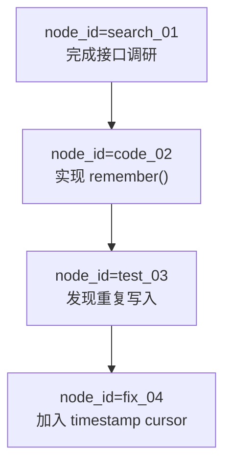

# 7. 短期记忆：外置上下文与 Mermaid 符号图

长期记忆解决“跨 Session 记住什么”；短期记忆解决“当前任务太长，如何不让上下文窗口爆掉”。这是 TencentDB-Agent-Memory 里很有辨识度的一条线。

## 核心想法：原文外置，结构留在上下文



这不是“把内容压缩后丢掉”，而是把压缩做成可逆的索引：Mermaid 节点带 `node_id`，需要细节时可以回到原文。

## 一个教学版 Canvas



Agent 只需要知道当前在 `fix_04`，以及它可以读取 `test_03` 的原始错误日志；没必要每轮重新看完整的搜索结果。

## 什么时候触发 offload？

不要只看消息条数，应该估算 token 或字符：

```ts
const estimatedTokens = Math.ceil(text.length / 4)
if (estimatedTokens > contextWindow * 0.7) {
  await offloadVerboseParts(messages)
  return injectCanvas(messages, canvas)
}
```

官方工程还区分 mild offload 与 aggressive compression，并在工具调用之后更新当前 Canvas。教学版先实现一个阈值就足够理解主线。

## 与 L2 场景的区别

| | 短期 Canvas | L2 Scenario |
| --- | --- | --- |
| 生命周期 | 当前长任务 | 跨回合/跨 Session |
| 输入 | 工具调用、错误日志、阶段状态 | 已沉淀的 L1 记忆 |
| 重点 | 保持当前方向感 | 恢复一个工作场景 |
| 回溯 | `node_id` → refs 原文 | 场景 → L1 → L0 |

## 安全注意

外置文件可能包含密钥、用户隐私和工具输出。生产系统要做：目录隔离、权限控制、敏感字段脱敏、生命周期清理，并明确哪些内容可以被 Agent 工具读取。
