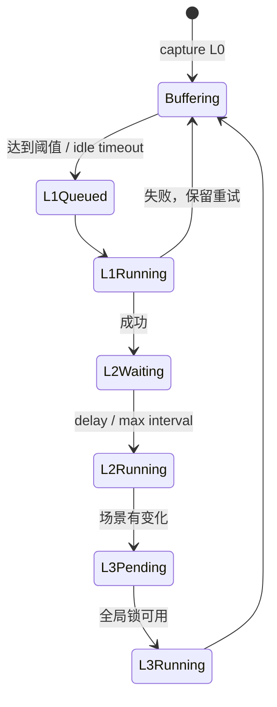

# 8. 生产化链路：Pipeline、Hook 与 API

到这里，核心算法已经清楚；真正做成工程，还要处理异步、并发、隔离和跨进程调用。

## Pipeline 的触发策略

官方 `MemoryPipelineManager` 为每个 Session 维护缓冲区和计时器：

- L1：达到消息阈值立即处理；空闲超时也会 flush。
- warm-up：新 Session 可以用 `1 → 2 → 4 → 8` 的阈值快速建立初始记忆。
- L2：L1 完成后延迟触发，同时有最小/最大间隔，避免频繁归纳。
- L3：全局互斥 + pending 标记，避免多个会话同时重建 Persona。



## Hook 到 Core 的最小契约

```ts
interface MemoryCore {
  recall(input: { query: string; identity: Identity }): Promise<RecallResult>
  capture(input: { sessionId: string; messages: Message[] }): Promise<CaptureResult>
  search(input: SearchInput): Promise<Atom[]>
}
```

OpenClaw、Hermes、LangChain 都可以实现自己的 Adapter，只负责把宿主事件转换成这个契约。

## Gateway 的意义

单进程教学版直接 import Core 很方便；生产环境通常把 MemoryCore 做成 sidecar 或独立服务：

```text
Agent 进程 ── HTTP/SDK ──> Gateway ──> Store + Pipeline + LLM
```

这样做的收益是：多个 Agent 可以共享同一个记忆服务，服务端统一做身份隔离和队列；代价是网络延迟、鉴权、服务发现和部署复杂度。

## 三维隔离：team / agent / user

现代 Agent Memory 不应只用 `session_id` 隔离。官方 v3 API 强制要求 `team_id`、`agent_id`、`user_id`，避免“同一个用户在不同 Agent 的记忆串线”。L2/L3 可以按团队和 Agent 聚合，L0/L1 还可以按 Session 收敛。

```text
scope = (team_id, agent_id, user_id, session_id?)
```

教学版为了易懂只使用 `sessionId`；在扩展章节会加入迁移方案。

## 失败降级矩阵

| 依赖失败 | 推荐行为 |
| --- | --- |
| LLM 提取失败 | 保留 L0，记录错误，稍后重试 |
| Embedding 失败 | 降级 BM25/关键词 |
| FTS 不可用 | 降级内存扫描或返回空结果 |
| Persona 文件损坏 | 跳过 L3，不阻断 L1 |
| Recall 超时 | 空上下文继续回答 |
| Gateway 不可达 | Agent 正常工作，capture 进入本地待发送队列（生产可选） |

## 观察性要记录什么？

不要只打“recall success”。至少记录：召回策略、候选数、最终注入条数、注入字符数、耗时、提取成功率、去重动作分布和 L0→L1 延迟。
