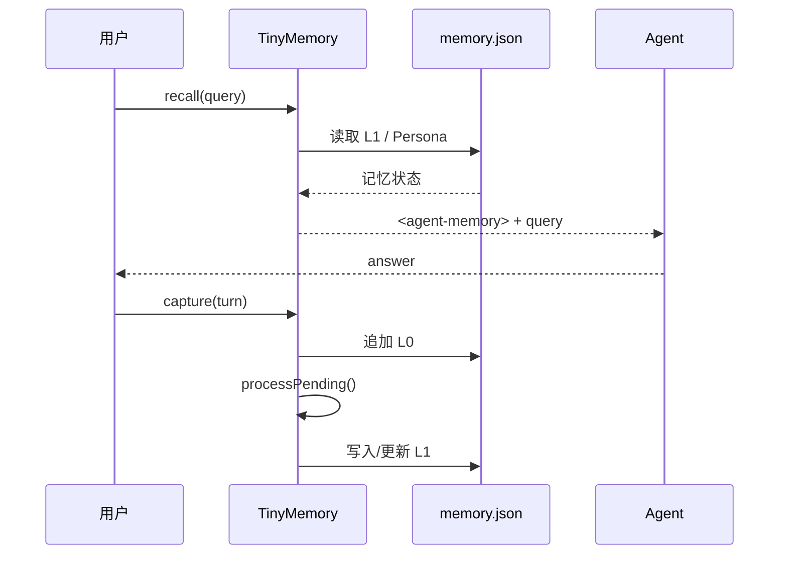

# 9. 最终项目：Tiny Memory

最终项目在 `examples/final/src/`，用不到云服务，完成一条最小闭环：

```text
capture L0 → processPending → extract L1 → key-based dedup/update → search → recall prompt
```

## 目录结构

```text
examples/final/
└── src/
    ├── memory.ts   # Store、清洗、规则提取、去重、召回
    └── demo.ts     # 三轮对话演示完整链路
```

## 设计取舍

| 真实系统 | 教学版 |
| --- | --- |
| SQLite/TCVDB + 文件 | 一个 JSON 文件 |
| LLM JSON extraction | 规则提取器 |
| BM25 + embedding + RRF | token/n-gram overlap + priority |
| L2 Markdown + L3 Persona | recall 时从 Atom 生成简化 Persona |
| Gateway + SDK + Hook | 一个 TypeScript 类 |

这不是把复杂系统“做错”，而是保留接口和数据流，把基础设施替换成可观察的最小实现。

## 运行

```bash
cd tencentdb-agent-memory-tutorial
npm install
npm run demo:final
```

程序会依次：

1. 将三轮消息清洗后追加到 `examples/final/data/memory.json` 的 L0。
2. 只处理尚未处理的 L0，提取用户消息中的偏好、事实、决策和约束。
3. 用 `key` 模拟冲突检测：例如同一项目的包管理器发生变化时更新旧 Atom。
4. 搜索“项目测试怎么跑？”并生成带边界的 `<agent-memory>`。

## 阅读代码的顺序

### 第一步：先看 `capture`

关注为什么先 `clean()`、再过滤、最后持久化。把“存证据”和“做理解”分开，是整个项目最重要的边界。

### 第二步：看 `processPending`

`processedL0` 是一个极简 checkpoint。真实系统会按 Session 保存游标，并用锁/事务保证并发安全。

### 第三步：看 `extract`

它返回 `Atom | null`，将提取策略封装起来。把它换成真实 LLM 时，应该让模型输出同样的 Atom JSON，再经过 schema 校验。

### 第四步：看 `recall`

召回将 Persona 和本轮动态命中结果分开，再统一施加 `maxChars`。这对应官方实现的 stable context / dynamic context 设计。

## 最终项目的运行链路



## 你应该亲手完成的三个改造

1. 把 `extract()` 换成调用 OpenAI-compatible API 的 JSON 输出，并增加 zod/schema 校验。
2. 把 `search()` 拆成 lexical list 和 vector list，再接上 Demo 3 的 `rrfMerge()`。
3. 将 `sessionId` 扩展为 `{ teamId, agentId, userId, sessionId }`，在读写和搜索时都校验 scope。
