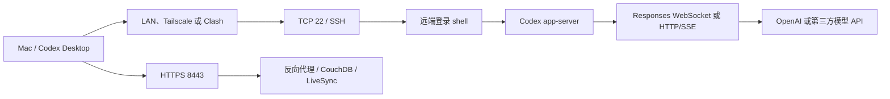
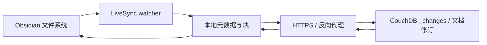

# 从网线到模型流：Mac 管理多台 Linux、Windows 与 Codex Remote 的完整实践

> 本文复盘一次真实的远程开发环境建设：以 Mac 为统一入口，管理多台 GPU Linux 服务器、一台同步节点和一台 Windows 开发机，处理 Ubuntu Server 开机无网、SSH 密钥、Tailscale、Clash、Windows OpenSSH、Codex CLI、第三方模型 Provider、Codex Remote 重连，以及 Obsidian Self-hosted LiveSync。文中的设备名、地址、用户名和目录均已替换为示例值；私钥、密码、API Key、Setup URI 永远不能公开。

## 一、最终目标与系统全景

这次工作的目标并不是“让一条 `ssh` 命令偶尔成功”，而是建立一套开机后可自动恢复、故障时可分层定位、工具升级后可重复验收的远程开发环境。

最终角色如下：

| 设备 | 角色 | 主要连接 | 关键配置 |
|---|---|---|---|
| MacBook | 统一客户端与 Codex Desktop 所在机器 | LAN、Tailscale、SSH | `~/.ssh/config`、用户私钥、Clash |
| GPU-A | GPU Linux 服务器 | SSH，部分路径经过跳板 | 用户级 Node/npm、Codex、第三方 Provider |
| GPU-B | GPU Linux 服务器 | SSH | Codex、第三方 Provider、远程开发 |
| GPU-C | GPU Linux 服务器 | SSH | Codex、第三方 Provider、跳板连接 |
| Sync-Node | Ubuntu Server、同步服务节点 | LAN 或 Tailscale | DHCP、`systemd-networkd`、LiveSync/CouchDB |
| Win-Dev | Windows 原生开发机 | LAN 或 Tailscale + OpenSSH | 管理员公钥、Git Bash、原生 Codex app-server |

Mac 的 `~/.ssh/config` 最终使用 `gpu-a`、`gpu-b`、`gpu-c`、`sync-node`、`win-dev` 等稳定示例别名。别名把“我想连接哪台机器”与“它当前使用哪个 IP、用户和密钥”分离，应用层只需要记住 `ssh win-dev`，底层地址可以独立调整。

整条链路可以抽象为：



这张图最重要的意义是：任何一个“连接失败”都可能来自不同层。网线、DHCP、TCP、SSH 认证、shell、PATH、app-server、WebSocket、代理和模型 API 不是同一个问题。

---

## 二、先建立网络分层思维

### 1. 从物理链路到应用层

远程开发常见故障可以按下表定位：

| 层次 | 负责什么 | 常见现象 | 优先检查 |
|---|---|---|---|
| 物理/链路层 | 网线、网卡、交换机端口 | 网卡无 carrier、灯不亮 | `ip link`、交换机、网线 |
| IP 层 | 地址、掩码、路由 | 没有 IPv4、无默认路由 | `ip addr`、`ip route` |
| 名称解析 | 域名到 IP | IP 能通，域名不通 | `resolvectl status`、`dig` |
| TCP 层 | 端口连接 | timeout、refused | `nc -vz host 22`、`ss -lntp` |
| SSH 协议层 | 加密、主机身份、用户认证 | host key、permission denied | `ssh -vvv`、`known_hosts` |
| Shell/运行时 | 解释命令、寻找程序 | syntax error、command not found | `$SHELL`、PATH、Node/npm |
| Codex app-server | Desktop 与远端代理通信 | SSH 成功但 Remote 失败 | `codex app-server --help`、Desktop 日志 |
| 模型传输层 | WebSocket 或 HTTP/SSE 流 | `Reconnecting... 1/5` | Codex 日志、代理、provider 配置 |
| 应用服务层 | CouchDB、LiveSync 等 | 401、TLS、CORS、同步失败 | `curl -v`、插件日志 |

排错原则是从下往上：网卡未获得地址时，不应该先修改 SSH 密钥；SSH 已显示 `Authenticated` 时，也不应该继续反复重装公钥。

### 2. Ubuntu Server 为什么开机后没有网络

DHCP 不是“联网开关”，而是一套地址租约协议。最常见流程可简写为 DORA：

1. 客户端广播 `DHCPDISCOVER`；
2. DHCP 服务器返回 `DHCPOFFER`；
3. 客户端发送 `DHCPREQUEST`；
4. 服务器以 `DHCPACK` 确认 IP、掩码、网关、DNS 和租约时间。

Ubuntu Server 不一定安装 NetworkManager。桌面版通常偏向 NetworkManager，服务器版常见 Netplan 生成 `systemd-networkd` 配置。因此 `NetworkManager.service does not exist` 不代表网卡坏了，而是当前机器可能根本不由它管理。

先识别实际管理者：

```bash
ip link
ip addr
ip route
networkctl list
networkctl status
systemctl is-active systemd-networkd
nmcli general status
sudo netplan get
```

若 Netplan 使用 `networkd`，典型 DHCP 配置类似：

```yaml
network:
  version: 2
  renderer: networkd
  ethernets:
    eno1:
      dhcp4: true
      optional: true
```

网卡名必须来自 `ip link`，不能照抄 `eno1`。修改后先用 `sudo netplan try`，确认可连接后再 `sudo netplan apply`。远程修改网络配置存在把自己踢下线的风险，`netplan try` 的自动回滚比直接 apply 更安全。

### 3. 路由与 DNS 为什么必须分开检查

拿到 IP 仍不等于能上网。主机还需要默认路由，例如：

```text
default via <gateway-ip> dev <interface>
```

`ping 1.1.1.1` 能通而 `curl https://example.com` 报域名错误，通常是 DNS；连网关都不通，则优先检查链路、VLAN、掩码和路由。代理环境下还要区分“系统能够解析域名”和“代理端替客户端解析域名”，例如 SOCKS5 的本地解析与远端解析会产生不同结果。

---

## 三、Tailscale、Clash 与 SSH 分别解决什么

### 1. Tailscale 是覆盖网络，不是 SSH

Tailscale 基于 WireGuard 建立加密覆盖网络，为节点分配 `100.64.0.0/10` 范围内的地址，并可通过 MagicDNS 提供稳定名称。它负责“让两台机器在三层网络上可达”，但不负责启动 `sshd`，也不替代 SSH 用户认证。

正确的检查顺序是：

```bash
tailscale status
tailscale ping <tailscale-host>
nc -vz <tailscale-host> 22
ssh -vvv <alias>
```

`tailscale ping` 成功只证明覆盖网络路径存在。目标 22 端口仍可能没有监听，Windows 防火墙仍可能阻止连接，公钥也仍可能不被接受。Tailscale 节点之间可能直接打洞，也可能通过 DERP 中继；中继一般增加延迟，但不会改变 SSH 认证逻辑。

### 2. Clash 的四个组成部分

Clash 及兼容实现可以抽象为四部分：

1. 入站监听器：HTTP、HTTPS CONNECT、SOCKS5 或 TUN；
2. 规则引擎：按域名、IP、进程、端口、GeoIP 选择路径；
3. 出站适配器：连接代理节点并完成协议封装；
4. DNS 模块：决定本地解析、远端解析、fake-ip 和分流。

HTTP 代理主要理解 HTTP 请求。HTTPS 通常通过 `CONNECT host:443` 建立 TCP 隧道；SOCKS5 是更通用的会话代理，可以转发 SSH 这类非 HTTP TCP 流；TUN 则创建虚拟三层接口，通过路由透明接管应用流量。

### 3. SSH 是否经过 Clash

普通 `ssh` 不会因为 macOS 打开了“系统 HTTP 代理”就自动走 Clash。可以显式配置 SOCKS5：

```sshconfig
Host gpu-a-via-clash
    HostName <target>
    User <user>
    IdentityFile ~/.ssh/id_rsa
    IdentitiesOnly yes
    ProxyCommand nc -X 5 -x 127.0.0.1:7891 %h %p
```

端口必须以 Clash 实际配置为准。很多客户端使用 7890/7891，但这只是习惯，不是协议规定。若启用 TUN，SSH 可能在不写 `ProxyCommand` 的情况下被透明接管；此时必须把局域网、Tailscale 网段和本地服务加入直连或路由排除，否则访问 `192.168.x.x`、`100.64.0.0/10`、`127.0.0.1` 可能被错误送进代理。

代理链路应理解为：

```text
ssh -> Clash 入站 -> 规则匹配 -> 代理节点或 DIRECT -> 目标 TCP 22 -> sshd
```

Clash 只搬运加密字节流，不会看到 SSH 私钥，也不会替代主机密钥验证。

---

## 四、SSH 协议：从握手到远程命令

### 1. SSH 不只是“加密密码”

一次典型 SSH 连接包括：

1. 客户端建立 TCP 连接，通常连接 22 端口；
2. 双方交换 `SSH-2.0-...` 版本字符串；
3. 双方发送 `SSH_MSG_KEXINIT`，协商密钥交换、主机密钥、加密、完整性和压缩算法；
4. 通过 ECDH/DH 产生共享秘密，共享秘密本身不在网络中明文传输；
5. 服务器使用主机私钥对交换结果签名，客户端用 `known_hosts` 验证服务器身份；
6. 双方派生两个方向各自的会话密钥；
7. 客户端进行密码、公钥或其他用户认证；
8. 认证成功后，在同一加密连接中打开一个或多个 channel。

现代 OpenSSH 常用 ChaCha20-Poly1305 或 AES-GCM 等 AEAD 算法，同时提供机密性和完整性。会话传输一段时间或达到一定数据量后还可以 rekey，不需要断开已有 channel。

### 2. 主机密钥和用户密钥是两套身份

- 主机密钥回答：“我连接的真是目标服务器吗？”服务器持有私钥，Mac 在 `known_hosts` 保存公钥指纹。
- 用户密钥回答：“这个客户端用户有权登录吗？”Mac 持有用户私钥，服务器在 `authorized_keys` 保存对应公钥。

公钥认证时，私钥不会上传。客户端用私钥对会话相关数据签名，服务器使用已保存的公钥验证。不要把 `id_rsa` 复制到服务器，也不要把服务器主机公钥误当成用户登录公钥。

主机重装或 IP 被复用后，先核对真实指纹，再处理旧记录：

```bash
ssh-keygen -F <host>
ssh-keygen -R <host>
```

不要长期设置 `StrictHostKeyChecking no` 来掩盖身份变化。

### 3. shell、PTY、exec channel 和端口转发

SSH 认证完成后可以打开不同 channel：

- 交互 shell 通常请求 PTY，因此会出现提示符、颜色和终端尺寸；
- `ssh host command` 通常使用无 PTY 的 exec channel，适合脚本和机器协议；
- SFTP 使用文件传输子系统；
- `direct-tcpip` 与 `forwarded-tcpip` 支持本地、远程和动态转发。

Codex Remote 使用的是无交互远程命令和 app-server 协议。因此“我能打开 SSH 终端”只是必要条件，不是充分条件：交互式 `.bashrc` 中存在的 PATH，可能在无交互 shell 中不存在；输出到 stdout 的欢迎文字也可能污染机器可读协议。

三种常见转发：

```sshconfig
# Mac 的 15432 通过 SSH 访问服务器本机的 5432
LocalForward 15432 127.0.0.1:5432

# 服务器的 18080 反向访问 Mac 的 8080
RemoteForward 18080 127.0.0.1:8080

# 本机建立动态 SOCKS5 代理
DynamicForward 127.0.0.1:1080
```

---

## 五、Mac 统一管理多台服务器

Mac 的用户级 SSH 配置位于 `~/.ssh/config`。推荐使用稳定别名：

```sshconfig
Host gpu-b
    HostName <address>
    User <linux-user>
    IdentityFile ~/.ssh/id_rsa
    IdentitiesOnly yes
    ServerAliveInterval 30
    ServerAliveCountMax 3

Host gpu-c
    HostName <address>
    User <linux-user>
    IdentityFile ~/.ssh/id_rsa
    IdentitiesOnly yes

Host win-dev
    HostName <lan-or-tailscale-address>
    User <windows-user>
    IdentityFile ~/.ssh/id_rsa
    IdentitiesOnly yes
    ServerAliveInterval 30
    ServerAliveCountMax 3
```

`ServerAliveInterval` 是 SSH 应用层保活，不是 TCP keepalive，也不是自动修复断网。客户端定期通过加密 channel 发送探测，连续超过 `ServerAliveCountMax` 未收到回复才判定连接失效。

检查最终合并结果：

```bash
ssh -G win-dev | grep -E '^(hostname|user|identityfile|identitiesonly) '
ssh -o BatchMode=yes -o PasswordAuthentication=no win-dev whoami
```

`ssh -G` 很重要，因为 OpenSSH 会合并多个 `Host`、`Include` 和通配规则，肉眼看单个配置块不一定等于最终生效值。

### Linux 公钥部署

Linux 用户目录通常使用：

```bash
umask 077
mkdir -p ~/.ssh
chmod 700 ~/.ssh
# 将公钥内容追加到 ~/.ssh/authorized_keys
chmod 600 ~/.ssh/authorized_keys
```

从 Mac 复制公钥的命令必须在 Mac 执行：

```bash
cat ~/.ssh/id_rsa.pub | ssh user@server 'umask 077; mkdir -p ~/.ssh; cat >> ~/.ssh/authorized_keys'
```

把这条命令粘贴到远程 Windows CMD，会让 Windows 把 Mac 的 `~/.ssh/id_rsa.pub` 当成 Windows 本地文件，自然会报找不到。

---

## 六、Windows OpenSSH：最容易混淆的一环

### 1. Windows 密码、PIN 与锁屏

SSH 密码认证通常使用 Windows 账户密码，不是 Windows Hello PIN。PIN 绑定到本机设备和 Windows Hello 凭据，不等同于可供网络身份验证的账户密码。微软账户、本地账户和域账户还可能使用不同用户名形式，因此先以 `whoami` 确认实际身份。

### 2. Windows 与 Linux 命令语法不同

Windows 默认远程 shell 常为 `cmd.exe`：

| Linux / Bash | CMD | PowerShell |
|---|---|---|
| `ls` | `dir` | `Get-ChildItem` |
| `$HOME` | `%USERPROFILE%` | `$env:USERPROFILE` |
| `~/.ssh` | `%USERPROFILE%\.ssh` | `$env:USERPROFILE\.ssh` |
| `cat file` | `type file` | `Get-Content file` |

当提示符是 `C:\Users\...>` 时，`ls`、`tail`、`$HOME` 不是合法 CMD 语法。判断自己处于哪个 shell，是跨系统排错的第一步。

### 3. Windows 管理员账户的 authorized_keys

普通用户通常读取：

```text
C:\Users\<User>\.ssh\authorized_keys
```

属于 `Administrators` 组的账户，Windows OpenSSH 常按默认规则读取：

```text
C:\ProgramData\ssh\administrators_authorized_keys
```

检查是否属于管理员组：

```cmd
whoami /groups | findstr /i Administrators
```

在管理员 PowerShell 中将公钥追加到专用文件后，需要收紧 ACL，并重启服务：

```powershell
icacls 'C:\ProgramData\ssh\administrators_authorized_keys' /inheritance:r
icacls 'C:\ProgramData\ssh\administrators_authorized_keys' /grant:r 'Administrators:(F)' 'SYSTEM:(F)'
Restart-Service sshd
```

公钥文件内容必须是 Mac 公钥的一整行；私钥仍只保留在 Mac。

### 4. sshd、防火墙与开机启动

管理员 PowerShell 中检查：

```powershell
Get-Service sshd
Start-Service sshd
Set-Service -Name sshd -StartupType Automatic
Get-NetFirewallRule -Name OpenSSH-Server-In-TCP
```

Tailscale 在线、机器能 ping 通，并不代表 `sshd` 已启动。`Connection refused` 常表示目标地址可达，但对应端口没有进程监听或被防火墙主动拒绝；timeout 更常见于路由、节点离线或防火墙丢包。

---

## 七、Codex Desktop Remote 的真实架构

### 1. Remote 不是把 Mac 界面“投屏”到服务器

Codex Desktop 读取 Mac 的 `~/.ssh/config`，使用 OpenSSH 连接远端，然后通过远端用户的登录 shell 查找并启动 `codex app-server`。项目文件、shell 命令、Node/npm、插件和模型配置来自远端环境；Mac 主要提供 Desktop UI 与 SSH 客户端。

官方说明同样强调：Remote 通过 SSH 启动远端 Codex app-server，`codex` 必须位于远端登录 shell 的 PATH 中。参见 [Codex Remote Connections](https://learn.chatgpt.com/docs/remote-connections.md)。

```mermaid
sequenceDiagram
  participant UI as Mac Codex Desktop
  participant SSH as OpenSSH
  participant Shell as 远端登录 Shell
  participant AS as Codex app-server
  participant API as 模型 Provider
  UI->>SSH: 连接 SSH alias
  SSH->>Shell: 无 PTY 执行 POSIX 引导脚本
  Shell->>Shell: 检查 SHELL、PATH、command -v codex
  Shell->>AS: 启动 app-server
  UI<->>AS: initialize / JSON-RPC / turn events
  AS<->>API: Responses WebSocket 或 HTTP/SSE
```

### 2. 为什么 `Authenticated` 后仍可能失败

日志出现：

```text
Authenticated to host using publickey
```

只说明 SSH 用户认证成功。后面仍可能因为以下原因失败：

- `codex` 不在无交互登录 shell 的 PATH；
- Node/npm 安装在 NVM 或自定义 prefix，但 shell 没加载；
- shell 不支持 Codex 发送的 POSIX 引导脚本；
- stdout 被 profile 欢迎文字污染；
- app-server 版本过旧、启动失败或初始化握手失败；
- SSH 连接正常，但 app-server WebSocket/控制通道随后断开。

因此应该验证真实启动路径：

```bash
ssh <alias> 'printf "shell=%s home=%s\n" "$SHELL" "$HOME"; command -v node; command -v codex; codex --version'
ssh <alias> 'sh -c "command -v codex && codex app-server --help >/dev/null && echo codex-remote-bootstrap-ok"'
```

### 3. Windows CMD 为什么破坏 Codex 引导脚本

Codex Remote 会发送包含 `sh -c`、`if`、`[`、`$SHELL`、单引号和变量展开的 POSIX 脚本。Windows CMD 不理解这些规则，并会先按自己的语法破坏引号和参数边界。于是可能出现看似矛盾的错误：SSH 已认证、日志中出现 `/usr/bin/bash`，但 Bash 报 `unexpected end of file`，随后 CMD 又报告 `'[' 不是命令`。

这并不是公钥错误，也不代表必须把 Windows 迁移进 WSL。最终方案是让 Git Bash 作为 Windows OpenSSH 的命令解释适配层，而实际启动 Windows 原生 Codex。

管理员 PowerShell 设置：

```powershell
New-ItemProperty -Path 'HKLM:\SOFTWARE\OpenSSH' -Name DefaultShell -PropertyType String -Value 'C:\Program Files\Git\bin\bash.exe' -Force
New-ItemProperty -Path 'HKLM:\SOFTWARE\OpenSSH' -Name DefaultShellCommandOption -PropertyType String -Value '-c' -Force
Restart-Service sshd
```

这是机器范围配置，会影响所有通过该 `sshd` 登录的用户。临时需要 Windows shell 时可在 Git Bash 中显式执行 `cmd.exe` 或 `powershell.exe`。

将 `wsl.exe` 直接设为 `DefaultShell` 并配 `-e` 不是等价替换：`wsl.exe -e` 期望“可执行文件及参数”，而 OpenSSH 交付的是一整段远程命令字符串，参数边界容易错误。WSL 需要专门包装器或独立入口；本次目标是运行 Windows 原生 Codex，因此 Git Bash 更直接。

### 4. Windows 原生 Codex 的安装与验证

没有 sudo 也可以把 npm prefix 放到用户目录。若 npm 的全局 bin 不在 SSH PATH，可在 `C:\Users\<User>\.local\bin` 放置 `codex.cmd` 包装器，转发到真实 npm 安装位置。

本次最终验证包括：

```text
command -v codex
/c/Users/<User>/.local/bin/codex
codex-cli 0.146.0
Logged in using ChatGPT
codex-remote-bootstrap-ok
```

Git Bash 路径 `/c/Users/...` 映射的是 Windows `C:\Users\...`。看到 Bash 路径只说明命令由 Git Bash 解释，不说明进程运行在 WSL。

---

## 八、Codex 为什么反复显示 Reconnecting：两种 WebSocket 必须分开

这是整篇文章最容易混淆的部分。Codex Remote 场景至少可能看到两条不同的长连接：

| 链路 | 两端是谁 | 用途 | 失败时表现 |
|---|---|---|---|
| Remote app-server 链路 | Mac Desktop ↔ SSH 远端 Codex app-server | JSON-RPC、任务事件、文件与工具状态 | Remote 主机变红、app-server reconnect |
| 模型 Responses 链路 | 远端 Codex app-server/CLI ↔ OpenAI 或兼容 Provider | 上传 turn、接收模型流式输出 | `Reconnecting... 1/5`、WebSocket→HTTP 回退 |

本机 Desktop 日志中的 `AppServerTransportSshWebsocket`、`hostId=remote-ssh-discovered:<alias>` 属于第一条；模型日志中的 `model_client.stream_responses_websocket`、`stream disconnected`、`falling back to HTTP` 属于第二条。两者都叫 WebSocket，但故障域完全不同。

### 1. WebSocket 为什么适合模型流

WebSocket 首先通过 HTTP/1.1 Upgrade 握手建立连接。成功时服务器返回 `101 Switching Protocols`，之后同一 TCP/TLS 连接变成全双工帧通道。使用 `wss://` 时，外层仍有 TLS 加密。

与普通一次请求一次响应的 HTTP 相比，WebSocket 的优点是：

- 客户端和服务器都能主动发送消息；
- 多轮事件不必反复建立新请求；
- 更适合 token delta、工具调用、状态更新等双向事件；
- 在链路健康时可降低重复握手和调度开销。

HTTP 回退路径通常仍使用 Responses API，但流式返回采用 SSE（Server-Sent Events）。SSE 是服务器到客户端的单向事件流，基于普通 HTTP 响应，代理、网关和企业网络通常更容易支持。它的兼容性往往更好，但双向交互需要额外 HTTP 请求，灵活性不如 WebSocket。

### 2. “先重连五次，再转 HTTP”到底是不是事实

对当前官方 Codex 源码的内置 OpenAI provider，结论是：**存在这个默认行为，但不能把它写成所有 provider、所有版本永远固定的规则。**

当前官方配置与源码表明：

- 内置 OpenAI provider 的 `supports_websockets = true`；
- `stream_max_retries` 默认是 5；
- WebSocket 单次建连超时默认是 15,000 ms；
- Codex 暴露 `transport.fallback_to_http` 指标，用于记录 WebSocket→HTTP 回退；
- `stream_idle_timeout_ms` 默认 300,000 ms，它是已建立流长时间无事件的空闲超时，不等同于 15 秒建连超时；
- `request_max_retries` 默认是 4，针对普通 HTTP 请求，也不要和流重连的 5 次混为一谈。

因此，在代理不能正确承载 WebSocket 时，用户可能看到：

```text
Reconnecting... 1/5
...
Reconnecting... 5/5
Falling back from WebSockets to HTTPS transport
```

如果每次都耗尽 15 秒，最坏观感接近 75 秒，之后 HTTP/SSE 却立即可用。这一现象也在 OpenAI 官方 Codex 仓库的连接问题中被复现和讨论：[WebSocket connect failures before HTTP fallback](https://github.com/openai/codex/issues/19821)、[75-second delay before fallback](https://github.com/openai/codex/issues/22634)。这些 issue 是问题报告和实现讨论，不等同于长期产品承诺；真正稳定的依据仍应以当前版本源码、配置参考和本机日志为准。

### 3. 为什么 HTTPS 能用，WebSocket 却失败

二者虽然都可使用 TLS 443 端口，却经过不同的中间件路径：

- HTTP 代理可能允许普通 HTTPS CONNECT，但不正确转发 Upgrade 头或长连接；
- 反向代理可能没有配置 WebSocket Upgrade；
- Clash 规则可能让 HTTPS 与 WSS 命中不同出口、DNS 或 IPv4/IPv6 路径；
- 系统 HTTP 代理可能被 HTTP 客户端读取，但 WebSocket 库没有读取同一组环境变量；
- NAT、防火墙、WAF 或 CDN 可能允许短 HTTP 请求，却在空闲时关闭长连接；
- TLS 拦截设备可能为 HTTPS 安装了受信 CA，但 WebSocket 客户端没有使用同一 CA 配置。

所以“网页能打开”“API 的 HTTPS 请求成功”不能证明 WSS 一定可用。反过来，WebSocket 失败也不一定是模型服务整体离线。

### 4. 回退之后为什么还会感觉反复重连

回退通常以当前进程或会话的传输状态为作用域。瞬时网络抖动可能使一次已建立的 WebSocket 中断；耗尽重试预算后切到 HTTP/SSE，本轮或后续请求可以继续完成。但新进程、新 session、provider 配置重新加载或版本升级后，客户端可能再次优先尝试 WebSocket。

同时，界面中的“重连”也可能来自 Remote app-server 链路，而不是模型链路。例如远端主机休眠、SSH 断开、app-server 退出时，Desktop 会独立调度 reconnect，并可能带指数退避和 jitter。不能仅凭一个 `Reconnecting` 字样判断是哪条链路。

### 5. 如何从日志确认是哪种重连

优先搜索以下关键词：

```bash
rg -n 'stream_responses_websocket|fallback_to_http|falling back to HTTP|stream disconnected|Reconnecting' ~/.codex/log
rg -n 'AppServerConnection|AppServerTransportSshWebsocket|reconnectAttempt|transport_connect_failed' ~/Library/Logs/com.openai.codex
```

判断方式：

- 包含 `responses_websocket`、provider、sampling request：模型传输层；
- 包含 `remote-ssh-discovered:<alias>`、SSH setup、app-server initialize：Remote 控制链路；
- 包含 `Permission denied`、host key、TCP timeout：更底层的 SSH 问题；
- 包含 `codex not found`、shell syntax：远端运行环境问题。

### 6. 代理环境中的处理策略

推荐顺序是：

1. 先确认不经过代理时 WSS 是否可用；
2. 再确认 Clash 的 HTTP/SOCKS/TUN 入站和规则命中；
3. 检查代理是否支持 WebSocket Upgrade 和长连接；
4. 检查 IPv4/IPv6、DNS、系统 CA 与 TLS 拦截；
5. 最后才考虑让自定义 provider 使用 HTTP/SSE。

对于明确不支持 WebSocket 的自定义 provider，可以显式配置：

```toml
[model_providers.example]
name = "Example HTTP Provider"
base_url = "https://api.example.com/"
wire_api = "responses"
supports_websockets = false
```

不要随意覆盖内置 provider、复制未经验证的 ChatGPT 内部地址或把访问令牌写进配置。`supports_websockets = false` 只表示选择 HTTP/SSE 传输，不会修复错误的 API 地址、认证、模型名或代理规则。

本次第三方服务使用的是自定义 provider；未声明 WebSocket 支持时，不应把 OpenAI provider 的 5 次 WebSocket 重试机制机械套到其他 provider。先看当前会话实际 provider 和日志，再判断走的是哪种 transport。

---

## 九、多台 GPU 服务器：Codex、PATH 与第三方 Provider

多台 GPU Linux 服务器最终都升级到了同一版 Codex CLI。没有 sudo 时，Node、npm 和 Codex 完全可以安装在用户目录，但必须处理“安装位置”和“当前执行位置”不一致的问题。

其中一台服务器曾同时存在旧版 `codex`、自定义 npm prefix、用户级 Node 和多份 PATH。排查命令：

```bash
type -a codex
command -v codex
npm prefix -g
hash -r
codex --version
```

交互 shell 能找到 `codex`，不代表 SSH exec channel 也能找到。NVM 常在 `.bashrc` 的交互分支之后加载，非交互任务需要显式加载 NVM，或把稳定的 wrapper/symlink 放进 `~/.local/bin`。

以兼容 Responses API 的第三方 Provider 为例，核心配置结构是：

```toml
model = "<provider-supported-model>"
model_provider = "third_party"

[model_providers.third_party]
name = "Third-party Provider"
base_url = "https://api.example.com/"
wire_api = "responses"
env_key = "THIRD_PARTY_API_KEY"
supports_websockets = false
```

模型名必须使用 provider 实际支持的名称。曾经出现 provider 已切换到第三方服务、旧会话却仍传递另一个 Provider 的模型名，因而被服务端拒绝。可能来源包括旧 thread、profile、环境变量、Desktop 模型选择器或缓存。修改默认模型后，应新建会话并检查启动元数据，而不是只看欢迎语。

真实验收：

```bash
codex exec --skip-git-repo-check --ephemeral --color never '只回复：Provider OK'
```

版本号只证明二进制能启动，真实调用才能同时覆盖 PATH、认证、provider、模型名、网络和流式传输。

Codex、OpenCode、Claude Code 的配置目录、认证方式、provider 字段和插件机制彼此不同。即使三者都指向同一个第三方 Provider，也应分别执行“版本 → PATH → 认证 → provider → 模型名 → 真实请求”六项验收，不能用 Codex 成功推断其他 CLI 成功。

---

## 十、Obsidian Self-hosted LiveSync 的同步原理

### 1. LiveSync 不是设备之间直接覆盖文件

LiveSync 在每台设备上维护本地状态。文件系统变化被 watcher 捕获，内容切块、计算哈希并写入本地数据库；客户端再通过 HTTPS 与 CouchDB 交换变化。



“文件已保存”不等于“远端已收到”。待上传、待下载、checkpoint、`Replication completed` 分别对应不同阶段。

### 2. CouchDB、MVCC 与冲突

CouchDB 使用 HTTP API 和 MVCC。客户端通过 `_changes` 读取 checkpoint 之后的变化，文档通过 `_id`、`_rev` 表示身份与修订。并发写入可以形成修订分支，而不是简单静默覆盖。LiveSync 再结合文件内容、块哈希和时间信息处理冲突。

删除通常表示为 tombstone，使离线设备恢复后不会把已删除旧文件无条件写回来。Reset、Rebuild、Overwrite Server 都可能改变同步权威状态，只有在完成备份并确认哪一份数据是权威副本后才能使用。

### 3. 回环地址、反向代理与 Tailscale

服务器上的 `127.0.0.1:5984` 只代表服务器自己。把它写进 Mac 的 Obsidian，Mac 会访问自己的 5984，而不是服务器。正确链路通常是：

```text
Mac Obsidian -> https://<sync-node>.<tailnet>.ts.net:8443 -> Caddy/Nginx/Tailscale Serve -> 127.0.0.1:5984 CouchDB
```

反向代理负责 TLS、域名、端口和必要的请求头；CouchDB 继续只监听回环地址，可减少直接暴露数据库的风险。

### 4. E2EE、Security Seed 与 Setup URI

启用端到端加密后，客户端在上传前加密内容。PBKDF2 使用口令、salt 和迭代次数派生密钥；因此 `Failed to obtain PBKDF2 salt` 也可能是网络或认证失败导致客户端根本没取到远端 seed，而不一定首先说明口令错误。

Setup URI 是一个加密的配置包，可包含服务器地址、数据库名、账号和加密设置。Setup URI 的解密口令只保护本次配置包，不等于 CouchDB 密码，也不等于 Vault 的内容加密口令。

正确迁移流程是从已正常工作的设备执行 “Copy settings as a new Setup URI”，在新设备导入，选择加入已有同步并 Fetch Data。不要选择 Initialise Server、Overwrite Server 或用空的新 Vault 覆盖远端。Setup URI 与口令都应视为敏感凭据。

### 5. 常见错误的层次

| 错误 | 含义 | 先检查什么 |
|---|---|---|
| `ERR_CONNECTION_REFUSED` | 地址可达但端口没接受，或错误使用本机回环地址 | URL、监听端口、反向代理 |
| `401 Unauthorized` | HTTP 服务已到达但认证失败 | CouchDB 用户、密码、数据库名 |
| TLS/certificate | 证书链、域名或代理有问题 | 使用域名、系统信任链、反代证书 |
| CORS/`Failed to fetch` | 浏览器层可能隐藏真实 HTTP 响应 | CORS、Obsidian Internal API、Network 面板 |
| PBKDF2 salt | 尚未取到远端加密初始化材料 | 先排网络和认证，再查口令 |
| 配置不匹配 | 本地和远端加密/切块规则不一致 | 备份后选择正确的 Apply/Fetch 方向 |

---

## 十一、真实排错时间线与关键转折

1. **Ubuntu 开机无网**：最初寻找 NetworkManager，却发现服务不存在；识别实际后端为 Netplan/`systemd-networkd`，再配置 DHCP 自动获取。
2. **整理 SSH 别名**：把原始 IP 连接统一为 `gpu-a`、`gpu-b`、`gpu-c`、`sync-node` 和 `win-dev`，用 `ssh -G` 验证最终参数。
3. **升级多台 GPU 服务器**：处理无 sudo、NVM、npm prefix 和多份旧版 Codex；`hash -r` 后确认执行的是目标版本。
4. **切换第三方 Provider**：统一 provider 与模型名，以真实 `codex exec` 验证，识别旧会话覆盖默认模型的问题。
5. **恢复 Windows 网络与 sshd**：先解决 Tailscale/局域网可达、22 端口和服务启动，再处理用户认证。
6. **区分 Windows 密码与 PIN**：账户密码可用于 SSH，Windows Hello PIN 不能等价替代。
7. **部署 Windows 管理员公钥**：用户目录已有 key 仍失败，最终识别 `administrators_authorized_keys` 专用路径和 ACL。
8. **安装 Windows 原生 Codex**：解决 npm prefix 不在 SSH PATH，以用户目录 wrapper 让无交互 shell 找到 `codex`。
9. **修复 POSIX 引导脚本**：公钥已成功但 CMD 破坏 Codex 脚本；最终以 Git Bash 作为 OpenSSH 默认 shell，启动的仍是原生 Windows Codex。
10. **解释重复 Reconnecting**：确认 Remote app-server WebSocket 与模型 Responses WebSocket 是不同链路；模型链路在默认重试预算耗尽后可以回退 HTTP/SSE。
11. **修复 LiveSync 地址**：服务器 CouchDB 的 `127.0.0.1` 不能直接给 Mac 使用，改为 Tailscale 域名上的 HTTPS 反向代理入口。

---

## 十二、可复用的验收与排错清单

### 网络层

```bash
ip link
ip addr
ip route
resolvectl status
tailscale status
tailscale ping <host>
nc -vz <host> 22
```

### SSH 层

```bash
ssh -G <alias>
ssh -vvv <alias>
ssh -o BatchMode=yes -o PasswordAuthentication=no <alias> whoami
```

### 运行时与 Codex

```bash
ssh <alias> 'printf "SHELL=%s PATH=%s\n" "$SHELL" "$PATH"'
ssh <alias> 'command -v node; node --version; command -v codex; codex --version'
ssh <alias> 'codex app-server --help >/dev/null && echo app-server-ok'
```

### 模型与传输

```bash
codex exec --skip-git-repo-check --ephemeral '只回复 OK'
rg -n 'responses_websocket|fallback_to_http|stream disconnected' ~/.codex/log
```

### LiveSync

```bash
curl -v https://<livesync-host>:8443/
```

裸 `curl` 得到 401 可能反而证明 TLS、DNS、路由和 HTTP 服务都已到达，只是没有提供 CouchDB 凭据。诊断时不要把“非 200”一概当作“服务器离线”。

---

## 十三、安全与长期维护

1. 私钥只保留在客户端；服务器只保存公钥。
2. 已经粘贴到聊天、截图或公开文本的 API Key 应立即轮换。
3. `~/.ssh`、`authorized_keys`、Windows 管理员 key 文件与 Codex 配置保持最小权限。
4. 使用 `IdentitiesOnly yes`，避免 ssh-agent 尝试过多无关密钥。
5. 不长期关闭主机密钥或 TLS 证书校验。
6. Tailscale、Clash 和 SSH 各自分层验收，不用代理成功推断 SSH 成功。
7. 修改 Netplan、Windows `DefaultShell`、防火墙或 sshd 前，保留第二条管理通道和可回滚方案。
8. Git Bash 作为 Windows OpenSSH 默认 shell 是系统级选择，应记录对其他 SSH 用户的影响。
9. 每次 Codex 升级后检查版本、PATH、app-server、登录状态、模型和真实请求。
10. 看到 `Reconnecting` 时先看日志确认是 SSH/app-server 链路还是模型 WebSocket 链路。
11. LiveSync 执行 Initialise、Reset、Rebuild、Overwrite 前先完成独立备份。
12. 博客中的 IP、用户名和目录也可能暴露基础设施结构，公开发布时应统一替换为示例值。

---

## 十四、参考资料与证据边界

- [Codex Remote Connections](https://learn.chatgpt.com/docs/remote-connections.md)：Remote 通过 SSH 启动远端 app-server，并使用远端登录 shell 与 PATH。
- [Codex App Server](https://learn.chatgpt.com/docs/app-server)：app-server 的 stdio/WebSocket/Unix socket transport、初始化与事件协议。
- [Codex configuration reference](https://learn.chatgpt.com/docs/config-reference)：provider 的重试、流超时和 WebSocket 支持字段。
- [OpenAI Codex provider source](https://github.com/openai/codex/blob/main/codex-rs/model-provider-info/src/lib.rs)：当前默认 `stream_max_retries`、WebSocket connect timeout 和内置 provider 能力。
- [WebSocket connect failures before HTTP fallback](https://github.com/openai/codex/issues/19821) 与 [75-second delay before fallback](https://github.com/openai/codex/issues/22634)：现实网络环境中的复现记录；它们属于 issue，不是稳定 API 合同。
- [Self-hosted LiveSync Quick Setup](https://github.com/vrtmrz/obsidian-livesync/blob/main/docs/quick_setup.md)：从已有设备生成 Setup URI 并安全加入现有同步。

本文对“五次重连”的表述特意保留版本边界：截至本文核对的当前源码，默认流重连预算是 5，WebSocket 建连默认超时是 15 秒，且存在回退到 HTTP 的实现与指标；未来版本可以调整这些默认值，其他 provider 也可以配置不同预算或完全不启用 WebSocket。排错应以正在运行的 Codex 版本、有效配置和日志为准。

## 结语

这次配置真正建立的不是几条 SSH 命令，而是一套分层判断方法：物理链路决定有没有 carrier，DHCP 和路由决定能否到达网络，Tailscale 提供覆盖网络，Clash 决定是否代理，SSH 验证主机和用户，shell 与 PATH 决定程序能否启动，Codex app-server 承担 Desktop 的远端执行，Responses WebSocket 或 HTTP/SSE 承担模型事件流，LiveSync 与 CouchDB 负责文件变化和冲突。

当这些层次被明确区分后，“连接不上”就不再是一个模糊问题。我们可以准确地说：是 DHCP 没拿到租约、TCP 22 未监听、公钥路径错误、CMD 破坏 POSIX 脚本、app-server 没进入 PATH、WebSocket 被代理阻断、客户端正在回退 HTTP，还是 CouchDB 的远端地址写成了本机回环地址。可维护的远程开发环境，最终依靠的就是这种可观察、可验证、可回滚的结构。
