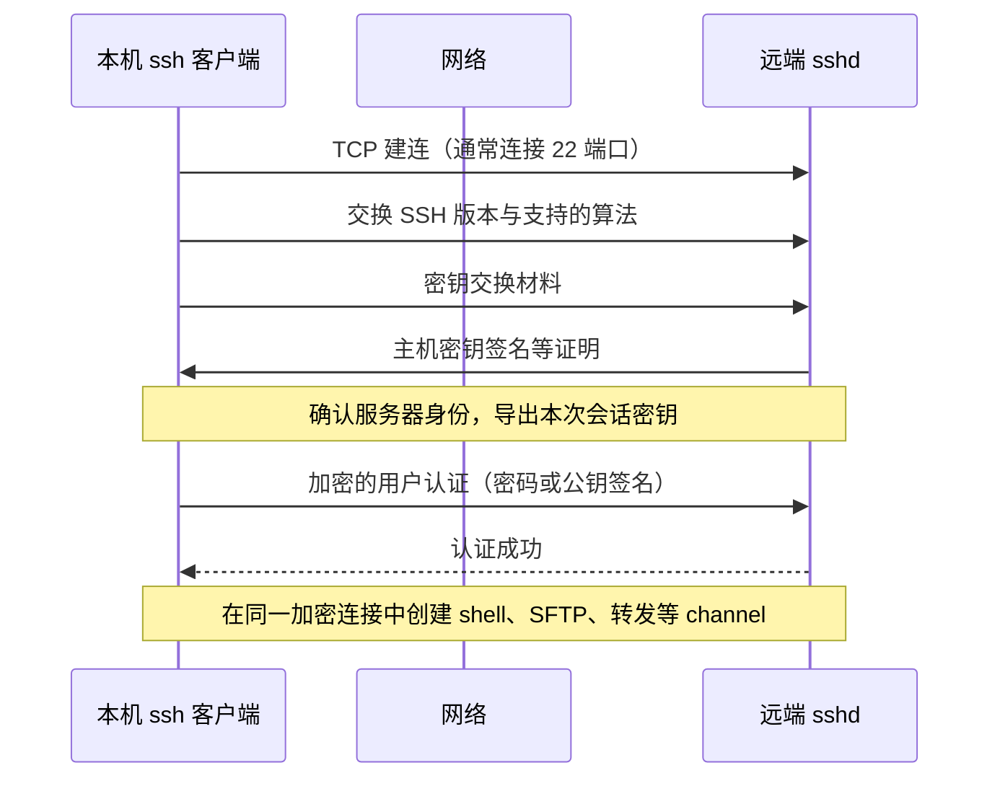
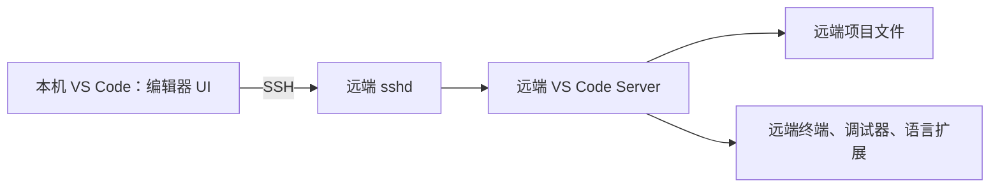
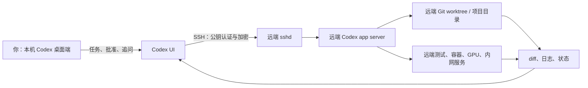
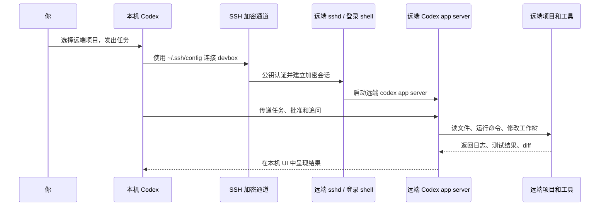

# 从 SSH 到 VS Code，再到 Codex：把 Agent 带到远端服务器

有一种很常见的开发场景：代码和依赖都在一台远端 Linux 服务器上。也许是那里有 GPU，也许是公司内网只能在那里访问，也许是项目的运行环境太重，不适合放在笔记本上。你希望自己仍坐在本机舒服地写代码、看 diff、下指令；但真正的文件读取、命令执行、测试和计算，都发生在远端。

过去，我们会先 SSH 登录，再用 Vim；后来，VS Code Remote-SSH 把本地 IDE 的体验带到了远端。现在，Codex 又把这个模式往前推了一步：不只是“我在远端写代码”，而是“我让一个 Agent 在远端的真实开发环境中工作”。

这篇文章沿着这条演进路线，从 SSH 和 OpenSSH 开始，经过 VS Code Remote-SSH，最后搭建一个可用、可理解、可控的 Codex SSH 工作流。

## 1. SSH：让两台机器在不可信网络上安全对话

SSH 是 **Secure Shell** 的缩写。它是一套网络协议，目标很朴素：让你可以安全地操作另一台机器。

假设你在咖啡馆的网络里，要连接一台云服务器。如果只建立一条普通 TCP 连接，路上的人可能窥探你的密码、命令和文件内容，甚至伪装成那台服务器。SSH 要解决的正是三个问题：

| 问题 | SSH 的做法 |
| --- | --- |
| 传输会被偷看吗？ | 后续数据通过会话密钥加密。 |
| 我连到的真是目标服务器吗？ | 用服务器的主机密钥验证身份。 |
| 服务器怎么知道登录者是我？ | 用密码或更常用的公钥认证。 |

你日常在终端里输入的：

```bash
ssh dev@devbox.example.com
```

其中 `ssh` 通常来自 **OpenSSH**。SSH 是协议，OpenSSH 是最普遍的开源实现；macOS、Linux 和新版 Windows 中常见的 `ssh`、`sshd`、`ssh-keygen`、`scp`、`sftp` 都是它提供的工具。

可以把它们简单地理解为：

- 本机的 `ssh` 是客户端，负责发起连接；
- 服务器的 `sshd` 是守护进程，负责接受连接，默认监听 TCP 22 端口；
- SSH 是两者说的“安全语言”。

## 2. 一次 SSH 连接，网络上实际发生了什么

理解这个过程，是后面理解 VS Code 和 Codex 为什么能“像在本地一样操作远端”的关键。



### 先有 TCP，再有 SSH

最底层是一个 TCP 连接，例如：

```text
你的电脑 192.0.2.10:51832  ──TCP──>  服务器 203.0.113.20:22
```

TCP 只负责可靠、有序地把字节送到对面。它不负责保密，也不负责确认对方身份。这正是 SSH 出场的地方。

### SSH 如何把连接变安全

TCP 建立后，双方先协商能共同使用的加密算法，再通过密钥交换得到本次连接专属的共享秘密。这个秘密不会以明文在网络上传输；双方各自计算出它，并据此导出会话密钥。

后面的终端输入、命令输出、文件传输和端口转发数据，主要使用快速的对称加密保护。公钥密码学则承担“身份验证”和“协商密钥”这类更适合它的任务。可以把它理解成：先用复杂但可靠的方式约定一个临时暗号，随后用这个暗号高效地持续交流。

### 先确认服务器，再证明你是谁

服务器持有一对**主机密钥**。第一次连接时，本机会显示服务器的指纹，询问是否信任；确认后会将其记入：

```text
~/.ssh/known_hosts
```

以后指纹不一致，SSH 会发出醒目的警告。这不一定代表遭到攻击——服务器重装也会导致主机密钥改变——但必须通过可信渠道核实，不能习惯性地删除记录后继续。

服务器身份没问题后，才轮到用户身份。如今更推荐公钥认证：本机保存私钥，远端的 `~/.ssh/authorized_keys` 保存对应公钥。登录时，远端要求客户端对当前会话相关数据做签名；客户端用私钥签名，远端用公钥验证。私钥从头到尾都不需要离开本机。

这就是为什么两个看起来很相似的文件其实职责完全不同：

| 文件 | 在哪里 | 它回答的问题 |
| --- | --- | --- |
| `~/.ssh/known_hosts` | 本机 | “这真的是我要连接的服务器吗？” |
| `~/.ssh/authorized_keys` | 远端 | “这个用户允许哪些公钥登录？” |

## 3. 从终端登录开始：先把 SSH 配好

所有上层远程开发工具都依赖一件事：普通的 SSH 必须先稳定可用。不要一开始就在 VS Code 或 Codex 里排错；先在终端里把基础链路验证清楚。

在本机生成一对 Ed25519 密钥：

```bash
ssh-keygen -t ed25519 -a 64 -C "roman@laptop"
```

建议为私钥设置口令。默认会得到：

```text
~/.ssh/id_ed25519       # 私钥：只能由你保管
~/.ssh/id_ed25519.pub   # 公钥：可放到远端
```

如果远端暂时允许密码登录，可以把公钥安装进去：

```bash
ssh-copy-id -i ~/.ssh/id_ed25519.pub dev@devbox.example.com
```

然后在远端确认关键文件的权限：

```bash
# 在远端，以 dev 用户执行
chmod 700 ~/.ssh
chmod 600 ~/.ssh/authorized_keys
```

接着，把主机信息收进本机 `~/.ssh/config`。它看似只是“少打一点字”，实际上是后续 VS Code 与 Codex 都能复用的一份连接契约：

```sshconfig
Host devbox
  HostName devbox.example.com
  User dev
  IdentityFile ~/.ssh/id_ed25519
  IdentitiesOnly yes
```

现在可以直接测试：

```bash
ssh devbox 'hostname && whoami && pwd'
```

输出应当是远端的主机名、`dev` 用户和远端目录。若失败，使用：

```bash
ssh -vvv devbox
```

`-vvv` 会输出连接、主机验证和密钥尝试的详细过程。这个命令仍是排查绝大多数 SSH 问题的第一工具。

## 4. VS Code Remote-SSH：把本地 IDE 的外壳留在本机

纯 SSH 很强，但终端体验并不总是舒服。开发者真正需要的是补全、跳转、调试、扩展、文件树与集成终端。VS Code Remote-SSH 做的事情，是把这些体验拆成两半：UI 在本机，实际开发环境在远端。



在本机安装 VS Code 和 **Remote - SSH** 扩展后，选择 `Remote-SSH: Connect to Host...`，再选择前面配置的 `devbox`。首次连接时，VS Code 会自动在远端安装和维护 VS Code Server。

这里有个常见误解：你**不需要**手工在远端安装完整的 VS Code，也不用自行维持本机和远端两个 VS Code 的版本完全一致。VS Code Remote-SSH 管理的正是一个与本机客户端协作的远端 Server。

连接以后，打开的工作区位于远端磁盘；新开的 VS Code 集成终端默认也是远端 shell。可以在终端运行：

```bash
hostname
pwd
```

确认自己确实身处远端。需要读取代码、调用编译器或调试器的扩展，也会安装在“远端”上下文中；纯 UI 类扩展则可以留在本机。

这个模式解决了“我如何在本地舒服地操作远端环境”。但它仍默认由人亲自打开文件、敲命令、运行测试。接下来，Codex 要解决的是：如果执行这些步骤的是 Agent，Agent 应该在哪台机器工作？

## 5. Codex SSH：不只是远程编辑，而是远程 Agent 执行

如果项目的依赖、数据、密钥、容器或 GPU 都在服务器上，那么让 Agent 在本机副本上工作，往往得到的是一个“不像生产环境”的答案。它可能找不到服务、跑不了测试，也无法验证实际部署条件。

Codex 的 SSH 连接把 Agent 放回真实的远端开发环境：本机仍提供聊天、任务、审批和结果界面；远端则提供项目文件、shell 和工具链。



换句话说，Codex SSH 的核心不是“把一个终端嵌到聊天窗口”，而是让 Agent 的工具调用发生在远端。它读取的是远端文件，执行的是远端命令，改动的是远端 Git 工作树，测试也使用远端实际存在的依赖与算力。

这带来一个极其重要的判断：**SSH 登录到哪个远端用户，Agent 就拥有该用户在操作系统中的权限。** 所以，给 Agent 配置 SSH 并不只是网络问题，也是权限设计问题。

## 6. 从零到一连接 Codex SSH

现在进入真正的搭建步骤。假设你已经能在本机运行 `ssh devbox`。

### 第一步：在远端准备 Codex CLI

先进入远端：

```bash
ssh devbox
```

远端需要以 `dev` 这个用户安装并认证 `codex` 命令。若该机器已有 Node.js 和 npm，可以安装公开的 Codex CLI 包：

```bash
npm install --global @openai/codex
```

然后登录：

```bash
codex login
```

许多服务器没有图形界面，这时可以使用设备码登录：

```bash
codex login --device-auth
```

终端会给出一个链接和一次性代码；在本机浏览器完成授权即可。完成后，检查：

```bash
codex --version
codex login status
command -v codex
```

最后进入项目确认环境：

```bash
cd /home/dev/projects/my-app
git status
```

这一步的本质是确认：远端登录用户既有 Codex 身份，也能访问真正要操作的仓库与工具链。

> `~/.codex/auth.json` 或系统凭据存储中可能包含 Codex 的访问令牌。它和 SSH 私钥一样敏感：不要提交到 Git、粘贴到聊天或复制到不受信任机器。

### 第二步：在 Codex 桌面端选择 SSH 主机

回到本机 Codex/ChatGPT 桌面端，打开 **Settings > Connections**，添加或启用 `devbox`，然后选择远端项目目录 `/home/dev/projects/my-app`。

Codex 会读取 `~/.ssh/config` 中具体的主机别名，并使用 OpenSSH 的配置规则连接。连接后，桌面端通过 SSH 使用远端用户的登录 shell 启动 Codex app server；因此远端的 `codex` 命令必须在这个 shell 的 `PATH` 中。

这也解释了一个常见故障：你手工 `ssh` 到服务器后能运行 `codex`，但桌面端连接失败。通常是因为你只在交互式 shell 的配置文件里设置了 `PATH`。应检查远端的登录 shell 配置，而不是只修改 `~/.bashrc` 后就认为所有启动方式都能读取它。

### 第三步：先验证“Agent 在哪儿”

首次连上后，先不要让 Agent改代码。发一个只读任务：

> 请只读检查当前仓库：告诉我 `hostname`、`pwd`、Git 当前分支、主要语言和测试命令。不要修改文件，也不要执行网络请求。

这一步特别重要。你应该看到远端主机名和远端项目路径，证明 Agent 不在本机工作。随后再让它做一个小改动：

> 阅读贡献说明和现有测试，为 `<具体需求>` 做最小修改，运行相关测试，展示 diff；不要提交或推送。

由此逐渐建立一个可靠的节奏：先让 Agent 检查和说明，再批准改动；先看测试结果和 diff，再决定是否提交。它和本机使用 Codex 的工作方式相同，只是所有实际执行动作落在远端。

## 7. 连接建立后，数据到底走到哪里

Codex SSH 并没有发明另一种网络协议。它仍然依托普通 SSH 的安全会话：



因此，SSH 在这里提供了两层重要保障：一是传输内容不会以明文暴露在网络中；二是远端只有在验证了你的 SSH 身份后，才会启动属于该用户的工作环境。

但也必须看到它的边界：SSH 不会自动把远端用户“降权”。如果你让 Agent 通过 `root` 登录，它就能以 root 的权限运行命令；如果远端 `dev` 用户能访问生产凭据、云 CLI 或所有数据库，Agent 在获准使用命令时也可能触及这些资源。因此，安全不是“有 SSH 就结束了”，而是从 SSH 身份一路延伸到远端账户、项目权限和审批流程。

## 8. 端口转发：让远端内网服务安全地到达本机

远端开发常常还会遇到数据库、管理页面等“只有服务器内网能访问”的服务。不要为了在本机查看它们就把端口直接暴露到公网；SSH 的本地端口转发通常更合适。

例如，数据库 `db.internal.example:5432` 只能被 `devbox` 访问：

```bash
# 在本机执行，并保持该会话打开
ssh -N -L 15432:db.internal.example:5432 devbox
```

随后，本机数据库客户端连接 `127.0.0.1:15432` 即可。流量会这样走：

```text
本机客户端 → 本机 127.0.0.1:15432 → SSH 加密通道 → devbox → 内网数据库:5432
```

`-L` 可以读成“**L**ocal listen”：监听端口开在本机。它的格式是：

```text
-L 本机监听端口:由远端主机访问的目标主机:目标端口
```

对于 Codex 自己的远端项目连接，通常不需要手工配置这种转发：桌面端会通过 SSH 启动和管理远端 app server。不要为了图方便把 app server 的传输端口直接暴露在公网。

## 9. 本机和远端都存在仓库时，怎样不把 Git 搞乱

不少人同时拥有本机副本和远端副本。这没有问题，但它们必须被视为两个独立工作树，而不是会自动同步的“同一个文件夹”。

最简单的策略是：一个任务只选择一个主工作位置。若任务交给远端 Codex，就在远端审阅、测试、提交；需要回到本机时，再通过 Git 的 commit、push/pull 同步，或使用 Codex 的 handoff 将聊天和 Git 状态明确转移到已连接主机。

不要在两台机器上同时修改同一分支，再期待系统自动解决冲突。SSH 解决的是连通性和安全性，Git 才负责版本协作。

## 10. 远端 Agent 的安全基线

把远端 Codex 看成一个拿着你开发账户工作的同事，会比把它看成“一个聊天窗口”更准确。几个基本原则是：

- 用普通开发用户连接，不要直接让 Agent 以 `root` 运行。
- 使用受口令保护的 Ed25519 私钥；确认密钥登录稳定后，再考虑关闭密码认证和 root SSH 登录。
- 在云安全组或防火墙中限制 SSH 来源；必要时通过 VPN 或跳板机进入内网。
- 定期审核远端 `authorized_keys`，删除旧电脑、离职成员和无效自动化密钥。
- 保护远端的 Git 凭据、云凭据、环境变量、MCP 配置和 Codex 身份凭据。
- 面对不熟悉的代码库，先要求 Agent 解释计划，谨慎批准高影响命令，审阅 diff 与测试结果。
- 不将 Codex app server 或 VS Code Server 作为公共网络服务暴露。

若你维护远端 SSH 服务，常见的服务端基线类似：

```sshconfig
# /etc/ssh/sshd_config 或 sshd_config.d 中的配置片段
PasswordAuthentication no
PermitRootLogin no
PubkeyAuthentication yes
```

改动 SSH 服务配置前，务必保留当前已登录的终端，并先检查语法：

```bash
sudo sshd -t
sudo systemctl reload ssh  # 有些发行版服务名是 sshd
```

然后用一个新终端验证仍能登录；确认无误再关闭旧会话，避免把自己锁在服务器外。

## 11. 当连接失败时，按层排查

远程开发的好处是能力强，坏处是链路更长。按下面顺序排查，通常最快：

| 现象 | 优先检查 |
| --- | --- |
| `Connection timed out` | DNS、路由、云安全组、防火墙、端口是否可达。SSH 认证尚未开始。 |
| `Connection refused` | 主机可达，但端口没有 `sshd` 监听，或端口配置错误。 |
| 主机身份变化告警 | 核对服务器主机密钥指纹；不要直接忽略。 |
| `Permission denied (publickey)` | 用户名、私钥、`authorized_keys` 和文件权限。 |
| `Too many authentication failures` | 本机尝试了过多密钥；在配置中加入 `IdentitiesOnly yes`。 |
| 桌面端找不到远端 Codex | 运行 `ssh devbox 'command -v codex && codex --version'`，检查登录 shell 的 `PATH`。 |
| Agent 的命令/测试失败 | 它已经在远端运行；检查远端项目目录、依赖、权限、容器和环境变量。 |

有两个很实用的辅助命令：

```bash
# 查看某个主机最终生效的 OpenSSH 客户端配置
ssh -G devbox

# 在远端确认 Codex 身份状态
ssh devbox 'codex login status'
```

## 结语：SSH 是通道，VS Code 是远端开发体验，Codex 是远端执行者

这条演进线可以浓缩成一句话：

> SSH 让你安全地登录远端；VS Code Remote-SSH 让你像在本地一样编辑远端；Codex SSH 则让 Agent 在远端的真实项目与工具链中完成工作。

从零到一的关键不是先记住很多命令，而是把三件事建立起来：**可信的 SSH 身份、可用的远端 Codex 环境、明确的远端权限边界**。这三者到位后，笔记本只是你的控制台，远端服务器才是 Agent 真正的工作现场。

## 参考资料

- [OpenSSH 官方手册](https://www.openssh.org/manual.html)
- [VS Code：Remote Development using SSH](https://code.visualstudio.com/docs/remote/ssh)
- [Codex：Remote connections](https://learn.chatgpt.com/docs/remote-connections)
- [Codex：Authentication](https://learn.chatgpt.com/docs/auth)
- [IETF RFC 4251：SSH Protocol Architecture](https://www.rfc-editor.org/rfc/rfc4251)
