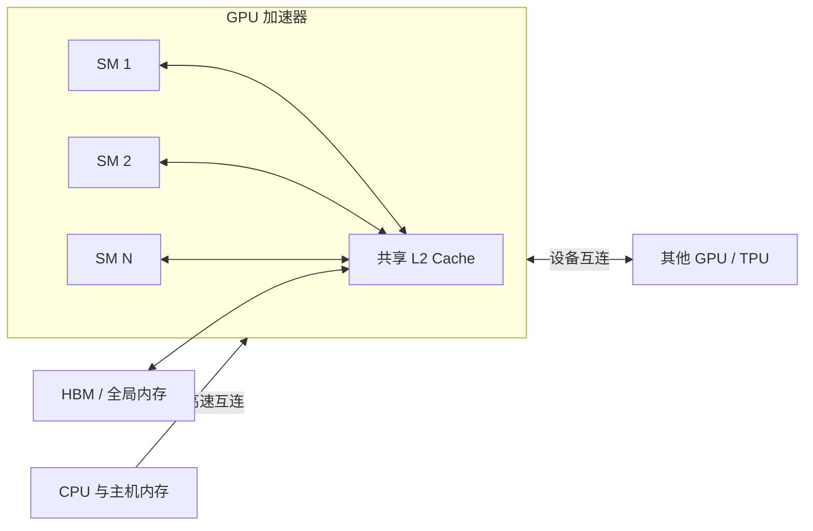
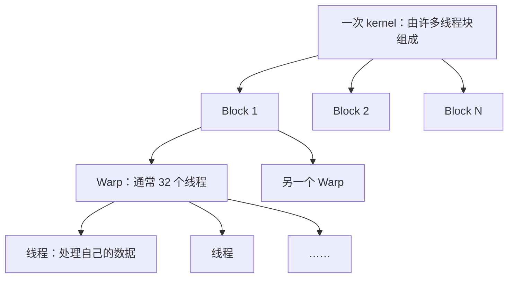
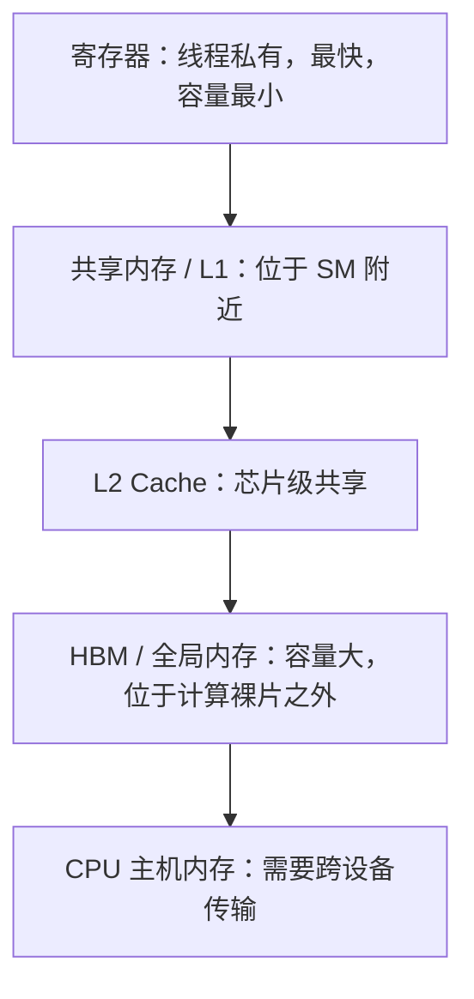
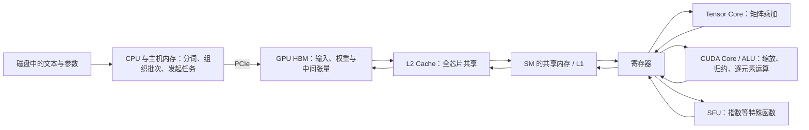

# 从芯片结构到大模型训练：CS336 Lecture 5 GPU 系统详解

> 本文以 Stanford CS336 Lecture 5 的逐字稿为主线，并参考三部中文科普视频补充显卡整机结构、自注意力的数据流和算法工程指标。文章面向没有 GPU 编程和大模型训练经验的读者，但尽量保留课程中的硬件细节、性能模型与工程案例。
>
> 课程视频：[CS336 Lecture 5: GPUs, TPUs](https://youtu.be/izZba4UA7iY?si=f-mkRDI4rDofeWHh) · [完整中文逐字稿](lecture5_transcript.md)

## 这节课真正想解释的问题

第一次接触 GPU 时，人们很容易把它理解成一种“比 CPU 更快的芯片”。这种说法没有完全错，却无法解释实际系统中最重要的现象：为什么同样是矩阵乘法，矩阵尺寸只变化一点，运行速度就可能突然下降；为什么增加几个无用的填充元素，程序反而能加速；为什么训练时主动丢弃中间结果、随后重新计算，有时比直接保存更快；为什么硬件已经拥有惊人的浮点计算能力，程序却仍然经常在等待。

CS336 Lecture 5 从一张矩阵乘法吞吐量曲线出发。曲线的横轴是矩阵维度，纵轴是 GPU 每秒完成的计算量。总体上，矩阵越大，硬件利用率越高；但曲线上同时存在锯齿、周期性低谷和尺寸边界处的突然下跌。这些现象说明，GPU 性能不是由算法的 FLOPs 单独决定的。线程怎样组织、矩阵怎样切块、数据怎样进入计算单元，以及任务能否均匀分配给所有 SM，都会改变最终速度。

这节课的主线因此不是记住若干 CUDA 技巧，而是建立一个硬件心智模型：**GPU 通过大规模并行提供计算吞吐量，但现代 GPU 的计算能力增长远快于数据搬运能力，因此大模型系统的核心问题逐渐从“能不能计算”转向“能不能及时把数据送到计算单元”。** 后半节课介绍的低精度、算子融合、重计算、合并访存和平铺，都是从这个矛盾中推导出来的。

## 一、从提高时钟频率转向大规模并行

早期处理器性能的提升，很大程度上来自更高的时钟频率。晶体管不断缩小，单条指令可以更快执行，程序无需改变就能获得速度提升。这一阶段常与 Dennard scaling 联系在一起：晶体管缩小的同时，功耗密度在一段时期内仍可控制，处理器因而能够持续提高频率。

进入 2000 年代后，这条路线逐渐触及功耗、散热和信号传播的物理约束。晶体管数量仍能增加，但单个核心的频率不能无限提高。计算系统于是转向另一种扩展方式：既然很难让一条指令继续变快，就让更多计算单元同时执行许多条相似指令。

GPU 正是这种思路的代表。它把芯片面积更多地用于大量轻量计算单元，而不是把绝大部分资源用于少数复杂核心。对于矩阵乘法、图像渲染和神经网络这类规则任务，一份大工作可以切成成千上万个小任务并行执行。大模型训练之所以与 GPU 紧密结合，不是因为 GPU 天生理解神经网络，而是因为神经网络中的主要运算恰好能够被大规模并行化。

## 二、CPU 与 GPU：两种不同的芯片预算分配方式

CPU 和 GPU 的差别首先是设计目标不同。CPU 更重视单个任务的延迟：接到一串复杂指令后，它希望尽快给出结果。GPU 更重视整体吞吐量：单个线程是否立即结束并不重要，重要的是整块芯片在一秒内一共完成多少工作。

为了降低单任务延迟，CPU 会把大量晶体管用于控制相关结构。这里的**控制单元**负责取指令、解释指令、预测程序可能进入哪个分支，并安排不同指令以较高效率执行。现代 CPU 还会使用分支预测、乱序执行和较大的缓存，以应对条件判断多、数据依赖复杂的通用程序。它的核心数量相对少，但每个核心具有很强的独立处理能力。

GPU 的晶体管预算则更多地投向算术单元。它保留必要的控制和调度结构，但不会为每一个轻量线程配备一套像 CPU 核心那样复杂的控制逻辑。大量线程共享控制路径，对不同数据执行相近指令。这种结构牺牲了处理任意复杂控制流的灵活性，换来了更高的并行计算密度。

可以把 CPU 想成少量经验丰富的工程师：每个人都能独立处理复杂且不断变化的问题。GPU 更像一座拥有大量工位的工厂：每个工位处理的任务比较简单，但只要生产步骤规则，工厂的总产量就很高。这个比喻的关键不在于谁“更高级”，而在于工作负载是否适合被复制和并行。

| 比较维度 | CPU | GPU |
| --- | --- | --- |
| 主要目标 | 降低单任务延迟 | 提高总体吞吐量 |
| 核心组织 | 少量复杂核心 | 大量轻量并行计算单元 |
| 控制逻辑 | 强，适合复杂分支和控制流 | 相对轻量，偏好规则执行 |
| 典型任务 | 操作系统、数据库、程序控制 | 图形、矩阵乘法、神经网络 |
| 性能来源 | 强单核、缓存、预测与乱序执行 | 大量线程同时工作 |

## 三、把一张 GPU 从外到内拆开

在继续讨论芯片之前，需要先区分“GPU”与“显卡”。严格来说，GPU 是显卡中央负责计算的处理器芯片；显卡则是一块完整设备，除了 GPU，还包括 PCB 电路板、显存颗粒、供电模块、PCIe 接口、显示接口、散热器和风扇。日常语境经常混用二者，但讨论性能瓶颈时必须知道问题发生在计算芯片、显存、供电散热还是主机链路。

显卡的 PCB 为各部分提供电气连接。供电模块通常由 PWM 控制器、MOSFET、电感和电容等器件组成，把电源输入转换为 GPU 和显存需要的低电压、大电流；散热模块通过均热板或热管把热量传至鳍片，再由风扇带走。供电和散热不直接执行矩阵乘法，却决定 GPU 能否在目标频率下长期稳定运行。峰值算力只有在功耗、温度和数据供给都允许时才能持续兑现。

一张用于计算的显卡也不是单独工作的完整计算机，而是连接在主机系统上的加速器。CPU 负责运行主程序、从磁盘读取数据、准备任务并发起 GPU kernel；GPU 接收任务后，在自己的计算单元和显存上执行。CPU 所使用的系统内存通常称为**主机内存**，GPU 使用的内存称为**设备内存**。两者可以通过 PCIe 交换数据，但跨设备传输比芯片内部访问昂贵得多。

从芯片的高层结构看，GPU 可以分成四类核心资源：负责执行任务的 SM、位于芯片上的缓存、位于芯片封装附近的大容量显存，以及连接主机或其他加速器的互连。数据通常由主机内存经过 PCIe 进入设备显存，再经过 L2、L1 或共享内存进入寄存器，最后交给执行单元；结果沿相反方向逐层写回。大模型训练的实际速度取决于这条数据通路能否持续工作，而不是其中任何一项单独足够强。

### 3.1 SM：GPU 的基本计算组织单位

**SM** 是 Streaming Multiprocessor 的缩写，中文常译为流式多处理器。课程将它作为理解 GPU 的基本单位：一张 GPU 包含许多 SM，每个 SM 能独立接收线程块，并在内部调度大量线程。不同 GPU 型号启用的 SM 数量可能不同，因此不能把某一个数字当成所有产品的固定配置。

SM 不是一个单独的“CUDA 核心”，而是一组计算、调度与存储资源的集合。现代 SM 还可能被划分为多个处理分区，每个分区配置自己的调度和部分执行资源；具体数量随架构变化，不能把某张 H100 结构图中的配置机械套到所有 GPU。课程的关键不是背诵完整芯片框图，而是理解这些部件如何共同支持大量线程。

一个便于入门的 SM 心智模型包含：线程束调度器、执行普通算术操作的 CUDA Core 或 ALU、执行矩阵乘加的 Tensor Core、处理指数和部分超越函数的特殊函数单元（Special Function Unit, SFU）、load/store 单元、寄存器文件，以及共享内存与 L1 cache。不同指令会被送往不同执行管线，同一个神经网络算子也可能先后调用多类单元。

### 3.2 控制与调度：决定下一组线程做什么

SM 内部的控制逻辑负责选择接下来执行哪个线程束。某个线程束如果在等待内存，调度器可以暂时切换到另一个已经准备好的线程束。GPU 中的线程非常轻量，暂停和恢复的成本较低，因此硬件可以用其他线程的计算覆盖一部分等待时间。这种机制通常称为延迟隐藏：内存访问本身没有变快，但芯片不必在等待期间完全闲置。

控制单元的能力仍然有限。GPU 的优势来自许多线程共享相近的执行过程，而不是每个线程都拥有一套复杂决策系统。因此，规则的程序能够充分利用硬件；充满不同分支的程序则会让一部分执行资源等待。

### 3.3 普通并行计算核心：执行标量与向量运算

SM 内部存在大量用于普通算术和逻辑运算的执行单元。市场宣传中常见的“CUDA Core”可以粗略理解为这类执行单元，但它不是一个与 CPU 核心等价、能够独立运行完整程序的核心。它更接近流水线中的算术部件，在 SM 的统一调度下完成加法、乘法、比较等操作。

这些单元负责逐元素激活、地址计算和许多通用运算。神经网络并非只有矩阵乘法，因此 GPU 仍需要灵活的普通计算能力。但在现代大模型中，最主要的计算量通常集中在矩阵乘法上，这也是 Tensor Core 逐渐成为性能中心的原因。

特殊函数单元补充了普通算术单元的能力。以 softmax 为例，求最大值、求和和除法会使用普通执行管线，指数函数则可能由 SFU 或相应近似实现承担。将“一个算子”映射到硬件时，不能只看它是否包含矩阵乘法，还要看其余逐元素和归约步骤由谁执行、是否需要同步，以及中间结果放在哪里。

### 3.4 Tensor Core：专门处理矩阵乘加

Tensor Core 是 GPU 内部针对小块矩阵乘加设计的专用执行单元。它接收若干小矩阵块，完成类似 $D=A\times B+C$ 的操作。更大的矩阵乘法会先被切成许多图块，再映射到大量 Tensor Core 上执行。

V100 一代引入 Tensor Core 是课程强调的硬件转折点。在此之前，GPU 仍可利用普通并行算术单元完成矩阵乘法；更早的通用 GPU 计算甚至需要把矩阵运算巧妙映射为图形着色器操作。专用矩阵电路出现后，矩阵乘法成为硬件明确偏爱的“特权操作”：相较于一般浮点运算，它可以获得显著更高的吞吐量。

Tensor Core 也改变了模型架构的工程约束。如果一种操作能表达成尺寸合适、精度受支持的矩阵乘法，它更容易接近硬件峰值；如果操作高度不规则或主要由零散逐元素计算构成，即使理论 FLOPs 较少，也可能运行得更慢。现代机器学习架构持续大量使用线性层、注意力投影和 MLP，不只是因为这些结构在数学上有效，也因为它们与矩阵硬件高度匹配。

### 3.5 寄存器、共享内存和 L1：SM 身边的快速工作区

寄存器是最靠近执行单元的存储位置。每个线程会使用一部分寄存器保存地址、循环变量和计算中的局部值。寄存器速度极快，但总量有限；单个线程占用过多寄存器，会减少同一 SM 能同时容纳的线程束数量，进而影响延迟隐藏能力。

共享内存是线程块可显式使用的片上存储。程序可以主动把数据从全局内存搬入共享内存，让同一线程块中的多个线程重复访问。L1 cache 同样位于 SM 附近，但它主要由硬件自动管理，缓存近期访问的数据。二者可能共享部分物理 SRAM 资源，编程语义却不同：L1 是自动缓存，共享内存是程序员可控制的协作空间。

## 四、GPU 如何把程序拆成线程、线程束和线程块

GPU 编程模型的最小逻辑单位是**线程**。例如，在一个逐元素加法中，每个线程可以负责一个元素；在矩阵乘法中，每个线程或一小组线程可以负责输出矩阵的一部分。大量线程执行同一份 kernel，但它们通过自己的索引读取不同数据。

硬件不会逐个调度线程，而是把连续线程组成**线程束**（warp）。在 NVIDIA GPU 中，一个 warp 通常包含 32 个线程。一个 warp 中的线程以 SIMT（Single Instruction, Multiple Threads）方式执行：它们共享同一条指令，但操作各自的数据。SIMT 兼顾了编程灵活性与硬件效率，因为程序看起来像在编写独立线程，底层却能统一发射指令。

多个线程进一步组成**线程块**（block）。线程块会被安排到某个 SM 上，并在该 SM 上完成执行。同一 block 内的线程可以访问共享内存并进行同步，因此 block 是数据复用和协作的基本边界。不同 block 原则上可以独立调度到不同 SM，这使 GPU 能够把大任务横向分散到整块芯片。

### 控制发散为什么会浪费计算

SIMT 的代价是**控制发散**。假设同一个 warp 中一半线程满足 `if` 条件，另一半进入 `else`。硬件通常无法让两组线程真正同时执行不同指令，而是先执行一个分支并屏蔽另一半线程，再执行另一个分支并屏蔽前一半。两条路径都要走一遍，部分计算通道在每个阶段处于空闲状态。

这解释了 GPU kernel 为什么倾向于使用规则计算和掩码。例如 ReLU 可以写成与零取最大值，而不是为正数和负数设计复杂分支。并不是 GPU 不能执行 `if`，而是同一 warp 内的线程如果走不同路径，吞吐量会受到影响。

### 从 PyTorch 到 PTX：一项计算怎样到达 GPU

日常训练代码通常不会直接控制每个线程。研究者在 PyTorch 或 JAX 中写出矩阵乘法、归一化和激活函数，框架将这些高层算子交给已有库或编译器；底层实现再启动一个或多个 GPU kernel。CUDA 提供线程、block、共享内存等编程抽象，PTX 则是更接近 GPU 指令集的中间表示。

SIMT 让这套低层程序仍然可以被人理解。程序员描述单个线程需要执行的指令，以及线程如何根据索引找到自己的输入；GPU 再把同一程序扩展到大量线程，而不是要求程序员逐一编写每个线程。运行时和硬件调度器负责把 block 分配给 SM，并在 warp 等待数据时切换到其他可运行 warp。

CUDA 不只是一种编程语言，而是一整套围绕 NVIDIA GPU 建立的软件平台：它包含编程模型、编译工具、运行时接口，以及 cuBLAS、cuDNN、NCCL 等面向矩阵计算、深度学习和多卡通信的基础库。PyTorch 等框架让使用者不必从零编写 kernel，但框架中的高性能算子仍要依靠这些底层库或专门生成的 GPU 程序。硬件峰值只是能力上限；编译器、算子库和调试工具是否成熟，决定了研究者能否稳定地接近这个上限。这也解释了为什么比较加速器时，不能只排列芯片参数，还要考察软件生态。

## 五、存储层次：容量越大，通常离计算越远

GPU 的存储并不是一个均匀的大空间。课程反复强调，真正理解 GPU 必须理解存储层次，因为数据位于哪一层，决定了读取成本。离计算单元最近的存储速度快但容量小；离得更远的存储容量大，却需要更高访问延迟和更多能量。

课程以 A100 的基准结果说明这种差距：L1 和共享内存的读取可能只需要几十个周期，而访问 L2 和全局内存会明显更慢。这里不必记住某个固定延迟，因为具体数字受架构与访问模式影响；需要记住的是数量级关系——频繁访问全局内存的代价远高于复用寄存器或共享内存中的数据。

GPU 产品标注的显存容量通常指全局内存。例如 H200 的 144 GB 指 HBM 容量，并不是每个 SM 都拥有 144 GB 快速共享内存。HBM 虽然名字中有“高带宽”，相较普通主机内存也确实很快，但它仍无法以寄存器或片上 SRAM 的速度向所有计算单元无限供数。

消费级显卡常见 GDDR 显存，数据中心训练卡则常见 HBM。二者都属于 GPU 的设备内存，但封装方式和数据通路不同：GDDR 通常由多颗显存芯片分布在 PCB 上，HBM 则将多层存储裸片堆叠起来，并通过很宽的接口连接加速器。不能仅凭“显存频率”判断带宽；一个简化估算是

$$
B=\frac{R_{\text{eff}}\times W_{\text{bus}}}{8},
$$

其中 $R_{\text{eff}}$ 是每个引脚的有效传输速率，$W_{\text{bus}}$ 是总线位宽，除以 8 是把 bit 换算为 byte。实际可用带宽还会受到访问是否连续、控制器效率和并发程度影响。显存**容量**回答“模型能不能放下”，显存**带宽**回答“数据能不能及时送到计算单元”；它们是两个不能互相替代的指标。

### 为什么不把整张芯片都做成 SRAM

如果 SRAM 更快，一个自然问题是：为什么不彻底去掉 HBM 或 DRAM，只使用巨大的 SRAM？原因是芯片设计需要在容量、速度、面积、功耗和成本之间权衡。SRAM 单位容量占用的芯片面积更大，需要持续供电维持状态，而且必须在物理上靠近计算单元才能发挥低延迟优势。把大模型所需的全部存储做成 SRAM，成本和能耗通常不可接受。

因此，GPU、TPU 和其他加速器普遍采用层次化存储：少量昂贵的快速存储服务当前计算，大量相对便宜的慢速存储容纳完整模型与数据。高性能程序的任务，就是主动安排数据在这些层级之间移动，并让进入快速存储的数据得到充分复用。

## 六、GPU 与 TPU：同一问题的两种工程答案

TPU 是理解 GPU 设计取舍的良好参照。课程把二者描述为一种“趋同进化”：当工程师试图构建高能效的机器学习加速器时，最终往往都会得到矩阵乘法单元、向量计算单元、控制结构，以及快慢分层的存储系统。

GPU 更强调通用性和细粒度并行。它包含较多 SM，每个 SM 内有较小但数量较多的矩阵与普通计算单元。GPU 可以处理矩阵乘法，也能较灵活地执行逐元素运算、自定义 kernel 和复杂模型结构。增加 SM 数量还能在内存系统允许的范围内扩展吞吐量。

TPU 更偏向机器学习专用设计。它使用相对轻量的控制单元和更大粒度的矩阵乘法单元，愿意牺牲一部分小任务上的灵活性，以换取大矩阵计算的能效。课程中的例子指出，某些 TPU 矩阵单元要求输入尺寸至少达到特定规模；当 batch 或矩阵太小时，硬件可能无法充分工作。

| GPU 概念 | TPU 中的对应概念 | 共同作用 |
| --- | --- | --- |
| SM | TPU 的处理单元（部分资料也称 TensorCore） | 组织独立执行与并行工作 |
| GPU Tensor Core | MXU（Matrix Multiply Unit） | 执行高吞吐矩阵乘法 |
| CUDA / 向量执行单元 | Vector Unit | 执行逐元素和向量操作 |
| 共享内存、L1、L2 | VMEM / SMEM 等片上存储 | 保存需要快速复用的数据 |
| HBM | HBM | 容纳大容量模型与张量 |

这里有一个容易混淆的命名问题：在 GPU 语境中，Tensor Core 指矩阵乘法单元；在部分 TPU 资料中，TensorCore 可能指更高层的处理单元。阅读架构资料时必须根据上下文判断，不应只看名称。

GPU Tensor Core 与 TPU MXU 在底层都可采用**脉动阵列**（systolic array）思想。数据在计算单元阵列中有规律地流动，每个单元重复执行乘加，并把部分结果传向下一个位置。TPU 往往使用更大、数量更少的矩阵阵列；GPU 使用更小、数量更多的矩阵单元。前者偏向大块规则运算，后者提供更细粒度的调度灵活性。

单芯片结构并不是 GPU 与 TPU 的全部差别。大规模训练需要成百上千个加速器协同，设备之间的网络拓扑、互连带宽、集合通信实现和编译器系统会显著影响扩展效率。课程指出，当任务扩展到集群级别时，网络往往比单芯片矩阵单元的差异更值得关注。

## 七、GPU 发展的三条曲线并不同步

课程用三条随硬件代际变化的曲线解释现代大模型系统的根本矛盾。这三项能力分别是：**计算吞吐量、内存带宽和设备互连带宽**。它们都在提升，但提升速度不同。

第一条曲线是计算吞吐量，通常以 FLOP/s 衡量。更多 SM、Tensor Core、专用矩阵电路和更低精度格式共同推动了峰值计算能力快速增长。尤其从 V100 一代以后，Tensor Core 与 FP16、BF16、FP8 等格式使矩阵乘法吞吐量大幅上升。

第二条曲线是 HBM 内存带宽，即显存每秒能向芯片传输多少数据。HBM 持续迭代，带宽也在增长，但其增速通常赶不上矩阵计算吞吐量。这里还要区分**容量**与**带宽**：显存容量决定模型和中间状态能否放得下，显存带宽决定这些数据能多快送进计算单元。容量增加并不自动意味着程序运行得更快。

第三条曲线是设备互连带宽，即 GPU 与 GPU、GPU 与主机，或加速器节点之间交换数据的能力。课程把它概括为“并行性”相关的蓝线。多卡训练需要同步梯度、传输激活或交换参数切片；模型规模越大、并行度越高，通信越容易成为瓶颈。互连速度也在提高，但相较计算吞吐量，其增长更加缓慢。

| 能力 | 解决什么问题 | 典型指标 | 课程强调的演进趋势 |
| --- | --- | --- | --- |
| 计算吞吐量 | 数据到达后能多快完成乘加 | TFLOP/s、矩阵吞吐量 | 增长最快 |
| HBM 带宽 | 单卡内部能多快搬运模型与张量 | GB/s、TB/s | 增长较慢 |
| 设备互连带宽 | 多卡之间能多快交换数据 | GB/s、链路带宽 | 增长较慢，规模化后更突出 |

三条曲线的差距意味着，未来优化越来越不可能只依赖增加算术单元。计算单元越来越多、矩阵乘法越来越快，但如果 HBM 无法及时供数，新增算力会空闲；如果设备间网络跟不上，多卡系统会把时间花在等待通信上。由此，大模型系统逐渐成为内存与通信问题。

因此，阅读一张计算卡的规格表时，至少要同时看六个维度，而不能只比较一个“算力”数字。

| 规格维度 | 它实际回答的问题 | 容易忽略的条件 |
| --- | --- | --- |
| 计算吞吐量 | 某类运算理论上每秒能完成多少次 | 必须同时注明 FP32、BF16、FP16、FP8 等精度，以及是否使用稀疏性 |
| 显存容量 | 模型参数、优化器状态、激活和 KV cache 能否容纳 | 容量大不等于读取快 |
| 显存带宽 | HBM 或 GDDR 每秒能搬运多少数据 | 标称带宽不等于任意访问模式都能达到 |
| 主机与设备链路 | CPU 内存中的数据进入 GPU 有多快 | PCIe 传输可能成为数据加载与卸载瓶颈 |
| 设备互连 | 多张卡同步和交换张量有多快 | NVLink 等直连与经过主机或网络的路径差异很大 |
| 功耗、散热与软件 | 峰值性能能否长期、方便地使用 | 还会影响供电、机房散热、开发与维护成本 |

这一趋势在推理中尤其明显。预填充阶段一次处理完整上下文，包含较大的矩阵乘法，通常更容易利用计算单元；逐 token 解码阶段每次只生成少量新结果，却需要反复读取权重和 KV cache，更容易受到内存带宽限制。因此业界开始研究将 prefill 与 decode 分离，甚至让不同类型的芯片分别承担计算密集和带宽密集的阶段。这是“计算—内存差距”在系统架构上的直接结果。

## 八、Roofline 模型：判断程序究竟在等什么

Roofline 模型把 GPU 性能分成内存受限与计算受限两个区域。横轴通常是**算术强度**，表示每搬运一个字节数据执行多少次浮点运算；纵轴是实际计算吞吐量。

当算术强度较低时，程序读入大量数据却只做少量计算。此时性能由内存带宽决定，Roofline 曲线随算术强度上升形成斜线。增加 GPU 的理论 FLOPs 没有太大帮助，因为计算单元大部分时间在等数据。

当算术强度高到足以持续喂饱计算单元时，程序进入计算受限区域。此时吞吐量接近硬件计算上限，Roofline 曲线变成水平线。继续增大矩阵或增加数据复用，不会突破 Tensor Core 的峰值。

矩阵乘法往往比逐元素操作拥有更高算术强度。ReLU 对每个元素只做一次简单比较或选择，却至少要读入并写出数据；矩阵乘法读入一个元素后，可以让它参与许多次乘加。因此，大尺寸矩阵乘法通常更容易进入 Roofline 的平台区域，而小矩阵和逐元素算子更容易停留在带宽受限区域。

## 九、六类优化如何从硬件约束中推导出来

课程后半部分介绍的技巧并不是互不相关的经验列表。除了控制发散直接来自 SIMT 执行方式，其余技巧大都围绕同一目标：减少 HBM 读写、增加数据复用，或者用富余计算换取稀缺内存。

### 9.1 避免控制发散：让一个 warp 保持同一步调

控制发散发生在同一 warp 的线程进入不同分支时。硬件需要依次执行各条路径，并屏蔽不属于当前路径的线程。优化方向不是完全禁止条件判断，而是让同一 warp 中的数据具有相近控制行为，或把简单分支改写为掩码和规则的算术操作。

### 9.2 低精度与混合精度：同时减少数据量并提高矩阵吞吐量

一个 FP32 数占 4 字节，BF16 或 FP16 通常占 2 字节，FP8 只占 1 字节。精度降低后，同样的 HBM 带宽可以传输更多数值，同样容量可以存放更多参数和激活；Tensor Core 也往往能以更低精度完成更多矩阵乘加。因此，低精度同时缓解内存瓶颈与计算瓶颈。

低精度训练并不等于把所有操作粗暴地改成一种格式。矩阵乘法的权重和激活可以采用 BF16 或 FP8，而乘加过程中的累积、softmax、指数运算或部分归一化可能仍需要 FP32。不同操作对动态范围和舍入误差的敏感度不同，系统必须为它们选择合适精度。这就是**混合精度训练**的核心：把低精度用于收益最大且数值安全的部分，把高精度保留给稳定性关键路径。

FP8 进一步展示了这种设计的复杂性。E4M3 使用 4 位指数和 3 位尾数，精度相对更高但动态范围较小；E5M2 使用 5 位指数和 2 位尾数，动态范围更大但有效精度更低。进入 8 位后，已经很难存在适合所有张量和所有阶段的统一格式。

为了避免数值溢出或下溢，FP8 张量通常需要缩放因子。较早的方法可能为一个大张量使用一个缩放因子，但张量不同区域的数值范围可能差别很大。MXFP8 等块缩放格式把矩阵划分为较小区域，为每组元素配置独立缩放因子，使有限位数能够覆盖更合适的局部范围。

块缩放也会引入新的系统成本。若缩放因子按每 32 个元素的分组布局，矩阵转置后，原来的分组关系不再适用。课程给出的实现思路是同时保存原始方向与转置方向的量化副本，从而避免每次转置都重新量化。低精度节省了计算和带宽，却增加了量化、反量化、缩放统计与副本管理的开销，所以理论位宽减半并不意味着端到端速度必然翻倍。

FP4 把这种权衡推向更极端的位置。仅用 4 位表示数值时，局部缩放、格式设计和层级选择变得更加重要。课程强调，实际训练必须判断哪些层和哪些算子能够安全量化；第一层、最后一层或数值敏感操作可能需要更高精度。量化是一门依赖实证验证的系统与数值科学，而不是简单的数据类型替换。

低精度之外，硬件还尝试利用**结构化稀疏**提高有效吞吐量。如果矩阵中的零以硬件规定的规则出现，矩阵单元可以跳过部分无效乘法；但稀疏约束也会削弱模型的表示能力，并要求训练过程产生合适结构。课程对这一方向保持谨慎：它在特定设置中有硬件收益，却不像低精度矩阵乘法那样已经成为普遍训练路径。

### 9.3 算子融合：中间结果不必每一步都送回 HBM

课程用“工厂和传送带”解释算子融合。SM 是工厂，HBM 是仓库，二者之间的内存通路是传送带。如果每完成一个小步骤就把半成品送回仓库，下一步再重新运回工厂，传送带很快成为瓶颈。

假设程序依次计算正弦、平方、余弦、平方和加法。若每个操作都是独立 kernel，每一步都可能从全局内存读取输入并写回输出。融合后的 kernel 可以只读入一次数据，在寄存器或共享内存中连续完成多个操作，最后写回最终结果。数学表达式没有改变，内存往返次数却减少了。

PyTorch 编译器和 JAX/XLA 可以自动完成部分简单融合；复杂模式仍可能需要专门 kernel。融合的边界受寄存器压力、共享内存容量、并行度和数值依赖影响，因此并不是融合得越大越好。但其基本原则始终是让中间数据尽量留在片上。

### 9.4 重计算：用便宜的 FLOPs 换昂贵的显存

反向传播需要前向阶段的中间激活。最直接的方法是保存所有激活，反向时直接读取；问题是大模型的层数、序列长度和 batch 增大后，激活会占用大量显存，并产生额外读写。

重计算的做法是只保留少量检查点，丢弃部分中间激活，在反向传播需要它们时重新执行对应的前向计算。课程用连续 sigmoid 的例子说明：原方案可能产生八次内存读写，重计算后可降到五次，但增加一部分重复计算。在计算能力充裕而显存访问昂贵的硬件上，这种交换可能改善速度，也能降低峰值显存。

Activation checkpointing 就是这一思想在训练系统中的常见实现。它提醒我们：减少 FLOPs 并不总等于更快。若额外 FLOPs 能显著减少 HBM 流量，主动多算一次反而可能更有效。

### 9.5 合并访存：利用 DRAM 的突发读取

全局内存通常基于 DRAM，而 DRAM 不是按一个孤立字节高效读取的。访问某个地址时，硬件会以连续块的形式返回数据，课程用约 128 字节的 burst 作为直观示例。若一个 warp 的线程访问落在同一连续区域，多个请求可以合并为较少的内存事务；若地址分散，每个线程可能触发不同事务，带宽利用率随之下降。

矩阵的行列布局因此会影响速度。若矩阵按行连续存储，而相邻线程沿行读取相邻元素，它们容易落入同一个突发窗口。若相邻线程分别读取不同的行、沿列跨步访问，地址可能相距很远，硬件为了取得少量有效数据却读取多个块。合并访存的本质，是让并行线程的逻辑邻接关系与物理地址的连续关系一致。

### 9.6 平铺：把慢速读取变成快速复用

平铺（tiling）是课程认为最重要的优化之一。大矩阵无法整体放入共享内存，但可以切成许多小图块。线程块先把当前需要的输入图块从 HBM 加载到共享内存，在片上反复读取并完成许多次乘加，最后把输出图块写回全局内存。

考虑两个 $N\times N$ 矩阵相乘。朴素实现中，同一个输入元素可能从全局内存被反复读取。若图块边长为 $T$，一次加载的数据可以在图块内部复用约 $T$ 次，从而把全局内存访问降低相应倍数。$T$ 越大，理论复用越充分；但图块也会消耗更多共享内存和寄存器，并可能减少 SM 上可并发的线程块数量，因此实际大小需要权衡。

平铺不仅是 kernel 技巧，也是一种通用的局部性思想。数据并行和张量并行在更高层同样会沿某个维度切分数据或权重；不同层次的系统都在尝试把一部分工作与所需数据放到同一计算位置，减少昂贵的跨边界移动。

图块大小通常由底层库或编译器选择，但自动选择并不简单。课程提到 PyTorch 的 `max-autotune`：编译器会实际尝试多种 kernel 配置和图块大小，通过基准测试寻找更快方案。这类搜索耗费编译时间，却能适应具体矩阵形状、共享内存容量和 GPU 型号。它也说明性能配置很难只靠一条固定规则推导，最终仍需在目标硬件上测量。

## 十、为什么矩阵尺寸增加 1，速度可能突然下降

课程开头的吞吐量曲线现在可以从三个层面解释。第一，大矩阵拥有更高算术强度，更容易从 Roofline 的内存受限区进入计算受限区。第二，矩阵尺寸是否与图块和突发读取边界对齐，会影响合并访存与空白计算。第三，图块总数与 SM 数量的关系会影响负载是否均匀。

假设 kernel 使用 $128\times128$ 图块。$256\times256$ 矩阵可以被四个完整图块覆盖；维度增加到 257 后，边缘会多出很薄的残余图块。GPU 仍需为这些图块分配线程和调度资源，但其中大部分位置没有有效工作。矩阵只增加一行一列，实际调度任务却可能增加很多。

对齐还会影响 DRAM burst。图块边界若与连续内存块对齐，硬件可以用较少事务读取完整图块；错开一个元素后，同样的数据区域可能跨越更多 burst，需要额外内存事务。适当 padding 虽然增加了少量无效元素，却能恢复规则布局。

课程引用 nanoGPT 的例子：把词表维度从 50,257 填充到 50,304，训练速度曾提高约 25%。这个数字不是普遍保证，但现象具有代表性。50,304 更适合被常见硬件粒度整除，矩阵乘法能够获得更好的对齐和图块利用率。模型“多算了一点”，系统却“少浪费了很多”。

另一个现象是 **wave quantization**。假设一轮可由所有 SM 同时处理一批图块。若图块数量略高于一轮能容纳的数量，剩余少量图块必须启动第二轮；第二轮中大部分 SM 没有任务，利用率会非常低。课程用矩阵维度从 1792 变到 1793 的例子说明，图块数跨过某个 SM 容量边界后，吞吐量可能突然下降。

因此，“矩阵维度最好能被 16、32 或某些图块大小整除”并不是对二的幂的迷信。它背后有明确机制：线程束宽度、Tensor Core 输入形状、共享内存图块、DRAM burst 和 SM 波次共同偏好规则尺寸。真正需要理解的是因果链，而不是机械地把所有维度乘以 32。

## 十一、一次自注意力究竟怎样在 GPU 内部流动

前面的章节分别介绍了芯片部件和优化原则，但初学者最容易困惑的仍是：当代码写下 `attention(Q, K, V)` 时，这些部件究竟按照什么顺序工作？补充视频《GPU 是如何一步步计算 Transformer 中的自注意力机制的？》提供了一个适合建立直觉的执行过程。下面的描述是教学化的数据流模型，不表示每个框架、每代 GPU 都会启动完全相同的 kernel；编译器可能融合步骤，具体图块尺寸与调度方式也会变化。

### 11.1 计算开始以前：CPU 准备任务，GPU 准备数据

文本首先被 tokenizer 转换为 token id。CPU 负责组织 batch、调用框架算子并向 GPU 提交 kernel。token id、模型参数和必要的状态需要预先进入 GPU 的 HBM；若它们仍在主机内存中，就要经过 PCIe 传输。多卡系统还可能通过 NVLink 或其他高速互连直接交换设备数据。PCIe、NVLink 和 HBM 承担的不是同一种通信：PCIe 主要连接主机与设备，设备互连主要连接加速器，HBM 则是单个加速器内部的大容量工作存储。

embedding 层根据 token id 从词嵌入表中取出对应行，得到每个 token 的向量表示。这个过程本质上更接近查表和数据搬运，而不是密集矩阵乘法，因此未必能充分利用 Tensor Core。向量进入后续线性层以后，规则的大矩阵乘法才成为主要工作。

### 11.2 一次投影同时生成 Q、K、V

自注意力先要把输入矩阵 $X$ 分别投影为查询、键和值：

$$
Q=XW_Q,\qquad K=XW_K,\qquad V=XW_V.
$$

实际实现常把三个权重沿输出维拼成 $W_{QKV}$，用一次较大的矩阵乘法生成 Q、K、V。这样做可以减少 kernel 启动次数，让输入 $X$ 被一次加载后参与更多计算，也更容易形成适合 Tensor Core 的大矩阵。权重通常位于 HBM，访问过的数据可能经过 L2 到达各 SM；kernel 再把当前图块搬到共享内存和寄存器，交给 Tensor Core 完成块级矩阵乘加。

整个输入不会由一个 SM 独自处理。运行时把输出空间切成许多线程块，分配给可用 SM；每个线程块处理一部分 token、通道或矩阵图块。同一份权重可能被多个 SM 使用，因此 L2 cache 可以减少一部分重复的 HBM 请求。SM 内部还会让多个 warp 交错运行：一个 warp 等待下一块数据时，调度器尝试发射另一个已经就绪的 warp。

### 11.3 拆分注意力头，再计算 $QK^\top$

生成的 Q、K、V 随后按 head 拆分。若模型维度为 $d_{\text{model}}$，注意力头数为 $h$，每个头通常处理 $d_k=d_{\text{model}}/h$ 维的向量。所谓“多头”并不是在 GPU 中存在一类名为 head 的物理核心，而是张量在逻辑维度上的切分；不同 head、batch 与图块可以共同提供并行任务。

每个头先计算分数矩阵：

$$
S=QK^\top.
$$

这是规则的矩阵乘法，主要由 Tensor Core 承担。大矩阵仍会被拆成硬件支持的小图块：线程块加载一块 Q 和一块 K，在片上重复使用它们，累积出 S 的一块结果。这里已经出现第一个关键选择：如果把完整 S 立即写入 HBM，下一步 softmax 就必须重新读回来；如果把后续步骤融合在同一个 kernel 中，中间图块便可能留在寄存器或共享内存里。

### 11.4 缩放与 softmax 不只是一个按钮

分数需要先除以 $\sqrt{d_k}$：

$$
\widetilde S=\frac{S}{\sqrt{d_k}}.
$$

这个逐元素缩放通常由普通算术执行管线完成，不需要 Tensor Core。随后对每一行应用 softmax。为了避免指数溢出，稳定实现不会直接计算 $e^{x_i}$，而是先求该行最大值 $m$：

$$
p_i=\frac{e^{x_i-m}}{\sum_j e^{x_j-m}}.
$$

这一行公式在硬件上包含多种工作。求最大值和求和属于归约，需要一个 warp 或线程块中的线程交换并合并局部结果；减法和除法由普通 ALU 执行；指数函数可由 SFU 或对应的近似指令实现；归约之间还需要同步。由此可见，softmax 虽然 FLOPs 不多，却包含读写、同步、特殊函数和跨线程归约，常常比只数算术操作所推测的更昂贵。

如果注意力含有因果掩码，未来位置的分数还要在 softmax 前被屏蔽。规则掩码可以通过索引和谓词执行，避免让同一 warp 出现大量复杂分支。最终得到的概率矩阵记为 $P=\operatorname{softmax}(\widetilde S)$。

### 11.5 概率乘以 V，再完成输出投影

接下来计算每个位置对 value 向量的加权和：

$$
Z=PV.
$$

这又是一次适合 Tensor Core 的矩阵乘法。各个 head 的结果随后在特征维上拼接，再乘输出投影矩阵 $W_O$：

$$
Y=\operatorname{Concat}(Z_1,\ldots,Z_h)W_O.
$$

“拼接”在数学描述中像一个独立步骤，但高性能实现不一定真的复制出一份新张量；只要布局允许，后续矩阵乘法可以直接按相应地址解释各 head 的结果。优化 GPU 程序的一项基本习惯，就是区分数学上的中间对象与内存中是否必须物化的中间张量。

### 11.6 真正昂贵的地方：中间结果反复往返 HBM

若按最朴素的方式为每一步启动独立 kernel，Q、K、V 写入 HBM 后会再次被读出；$QK^\top$ 生成的 $N\times N$ 分数矩阵写入 HBM，缩放和 softmax 又分别读写；概率矩阵最后还要重新读出与 V 相乘。每个 kernel 单看都完成了正确计算，但 SM 与 HBM 之间的“仓库往返”可能远多于必要数量。序列长度 $N$ 增长时，分数矩阵和概率矩阵按 $N^2$ 增长，这种数据流很快压过算术本身。

现在便能准确理解“GPU 没有被喂饱”是什么意思：Tensor Core 很快算完当前图块，却在等待下一批数据；普通核心和 SFU 完成 softmax 的某个阶段后，中间结果又要穿过存储层次；不同 kernel 的边界迫使本可留在片上的值落回 HBM。FlashAttention 要解决的正是这个数据流问题，而不是发明另一套注意力公式。

## 十二、FlashAttention 是前述原则的综合案例

标准 attention 先计算 $S=QK^\top$，再对 $S$ 做 softmax，最后计算 $O=\operatorname{softmax}(S)V$。朴素实现会把大小约为 $N\times N$ 的分数矩阵及若干中间结果写入 HBM。序列增长后，这些中间张量既消耗显存，也带来大量全局内存流量。

FlashAttention 的关键不是改变 attention 的数学定义，而是改变计算顺序。它把 $Q$、$K$ 和 $V$ 切成图块，将当前图块加载到 SRAM 中，在片上完成矩阵乘法和局部 softmax。普通 softmax 需要全局最大值与全局归一化和，看似无法逐块计算；在线 softmax 则维护当前最大值和归一化累加量，在读入新图块时对旧结果进行校正，因此不必同时保存完整分数矩阵。

在这个实现中，平铺负责局部复用，融合避免每个步骤把中间结果写回 HBM，在线 softmax 解开了全局归一化对完整矩阵的依赖，反向传播则可以通过重计算避免保存 $N^2$ 级激活。FlashAttention 因而是整节课的“验收案例”：理解它所需的每个部件，都来自前面建立的 GPU 与内存模型。

课程把 FlashAttention 放在最后，并不是要把所有 GPU 知识压缩成一种 attention 算法，而是用它证明硬件知识能够改变算法实现。相同的数学公式，在不同数据流和存储策略下，可以拥有完全不同的显存占用与实际速度。

## 十三、GPU 的下一步优化方向

GPU 的发展不会只表现为更多 FLOPs。计算吞吐量、HBM 带宽和互连带宽之间的差距将继续推动软硬件协同：芯片需要更高带宽和更大容量的存储、更灵活的低精度矩阵单元与更快互连；软件需要更好的融合、图块搜索、量化策略、重计算计划和通信调度；模型架构也需要考虑算子形状是否适合现有硬件。

低精度会继续向 FP8、FP4 及块缩放格式推进，但收益取决于数值稳定性与量化开销。SM 内部会继续围绕数据供给优化，使 Tensor Core、寄存器、共享内存和调度器保持高利用率。编译器则会承担更多自动选择图块、融合算子和生成专用 kernel 的工作，减少程序员手动处理硬件细节的负担。

与此同时，训练和推理可能使用不同的硬件配比。训练需要处理矩阵乘法、激活、梯度和跨卡同步；推理中的 prefill 偏计算密集，decode 偏内存带宽密集。未来系统可能按阶段、算子甚至网络层，把任务交给不同类型的加速器。GPU、TPU、拥有大量 SRAM 的推理芯片，以及晶圆级加速器，本质上都在重新分配计算、内存和通信的芯片预算。

## 结语：理解 GPU，就是理解数据如何流动

Lecture 5 最重要的结论不是“GPU 有很多核心”，而是 GPU 性能由计算、存储和调度共同决定。SM 提供大规模并行的执行容器；普通计算单元与 Tensor Core 承担不同类型的运算；寄存器和共享内存提供片上复用；HBM 容纳大规模状态；互连把单卡扩展到多卡系统。任何一部分跟不上，其他资源都可能空闲。

从这个结构出发，课程中的现象能够连成一条完整逻辑链：计算吞吐量增长快于 HBM 和互连，程序因此越来越受数据移动限制；低精度减少每个数的存储与传输成本，融合减少中间结果往返，重计算用富余算力换内存，合并访存利用 DRAM 突发机制，平铺把全局读取转换成片上复用；FlashAttention 则把这些原则组合进一个完整算法。

理解这条链之后，我们不再需要把“维度取 32 的倍数”“开启编译器自动调优”或“使用 FlashAttention”当成孤立经验。每一项工程选择都可以继续向下追问：它减少了哪一层的数据移动，改善了哪一种并行粒度，又让哪一类硬件单元保持了忙碌。能够回答这些问题，才真正建立了面向大模型训练的 GPU 心智模型。

---

## 补充视频与来源说明

本文以 [Stanford CS336 Lecture 5 中文逐字稿](./lecture5_transcript.md) 为主要依据，并使用下列三份中文科普视频补充显卡外部结构、CUDA 软件栈和自注意力的数据流。补充材料只用于解释课程中的硬件概念；其中涉及具体型号、市场价格和产品选择的内容没有纳入正文。

- [《【硬核科普】从零开始认识显卡》](https://www.bilibili.com/video/BV1xE421j7Uv/)（[完整逐字稿](./gpu_intro_transcript.md)）：用于补充 GPU 芯片与整张显卡的区别，以及 PCB、供电、散热、GDDR 显存和接口等组成部分。该视频没有可提取字幕，经授权下载临时音频并使用本机 Qwen3-ASR 转写后整理。
- [《GPU 是如何一步步计算 Transformer 中的自注意力机制的？》](https://www.bilibili.com/video/BV1zFFTziEdL/)（[完整逐字稿](./gpu_attention_transcript.md)）：用于补充 QKV 投影、分头、$QK^\top$、稳定 softmax、$PV$ 和输出投影在 GPU 中的数据流。该视频使用站点提供的中文字幕。
- [《（科普向）算法工程师需要知道的显卡知识》](https://www.bilibili.com/video/BV1m2P9zsEgW/)（[完整逐字稿](./gpu_for_engineers_transcript.md)）：用于补充 CPU/GPU 分工、CUDA 软件生态、显存容量与带宽、互连及总体使用成本。该视频没有可提取字幕，经授权下载临时音频并使用本机 Qwen3-ASR 转写后整理。

转写内容仅修正了明显断句、重复和术语错词。正文没有将补充视频逐句拼接，而是按照 CS336 的课程逻辑重新组织；涉及架构数量和执行细节时，也避免把单一型号的框图当作所有 GPU 的固定规则。

---

## 术语索引

| 术语 | 含义 |
| --- | --- |
| ALU | 执行加法、乘法、比较等普通算术与逻辑操作的单元。 |
| SM | GPU 的流式多处理器，包含调度、计算、寄存器和共享内存资源。 |
| CUDA Core | NVIDIA 语境下的普通并行算术执行单元，不等同于完整 CPU 核心。 |
| Tensor Core | GPU 中专门执行高吞吐矩阵乘加的硬件单元。 |
| SFU | 特殊函数单元，用于指数、倒数等部分特殊函数或近似运算。 |
| PCB | 承载 GPU、显存、供电与接口等部件并提供电气连接的印刷电路板。 |
| VRM | 把外部电源转换为 GPU 和显存所需电压与电流的供电模块。 |
| Thread | 执行一份 kernel、处理自身数据的轻量任务。 |
| Warp | 通常由 32 个线程组成的硬件调度与执行组。 |
| Block | 被安排到同一 SM、可以共享内存和同步的一组线程。 |
| SIMT | 多个线程对不同数据执行同一指令流的 GPU 模型。 |
| HBM | GPU 的大容量高带宽全局内存。 |
| VRAM capacity | 显存可容纳的数据总量，决定模型和运行状态能否放下。 |
| Memory bandwidth | 显存单位时间内可传输的数据量，决定数据供给速度。 |
| PCIe | 主机与 GPU 等设备之间常用的连接总线。 |
| NVLink | NVIDIA 提供的高速设备互连，可用于 GPU 间直接交换数据。 |
| CUDA | NVIDIA GPU 的编程平台与软件生态，包括编程模型、工具和基础库。 |
| SRAM | 用于寄存器、cache、共享内存等快速片上存储的技术。 |
| Arithmetic intensity | 每搬运一个字节数据所执行的浮点运算数量。 |
| Operator fusion | 把多个操作合成一个 kernel，减少中间结果的全局内存读写。 |
| Recomputation | 丢弃部分中间结果，在需要时重新计算，以节省显存。 |
| Coalescing | 让相邻线程访问连续地址，以合并成较少的内存事务。 |
| Tiling | 把大张量切成图块，在快速片上内存中重复使用。 |
| Wave quantization | 图块数跨过硬件并行容量后，新增不完整调度波次造成的利用率下降。 |
| MXU | TPU 中用于矩阵乘法的专用单元。 |
| FlashAttention | 通过平铺、在线 softmax、融合与重计算减少 HBM 访问的精确 attention 实现。 |
